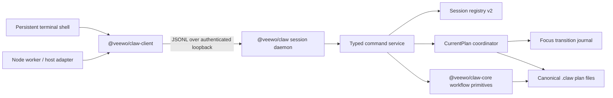

# Session-Scoped CLI Technical Design

Status: proposed technical design, 2026-07-31

Product contract:
[`2026-07-31-session-scoped-cli-spec.md`](./2026-07-31-session-scoped-cli-spec.md)

This document defines the implementation architecture for the session-scoped
Claw CLI. It deliberately starts a new runtime-state generation. Existing
session bindings, session-scoped workflow caches, and daemon runtime state are
not migrated.

## 1. Design goals

The implementation MUST:

- provide a persistent terminal session and equivalent typed Node API;
- make `(canonicalWorkdir, agentSessionId)` the session identity;
- centralize command execution behind an explicit session-aware context;
- centralize all current-plan focus changes in one Core coordinator;
- make multi-file focus transitions crash-recoverable;
- treat `end.leave` as a resumable `end.*` terminal that still runs end-state
  finalization;
- reuse the established local daemon discovery and security pattern;
- preserve the stateless CLI while consumers migrate incrementally;
- avoid importing heavy Core dependencies into `@veewo/claw-client`;
- meet the product-quality acceptance contract in the product specification.

## 2. Explicit non-goals

The implementation does not:

- migrate legacy session runtime or cache state;
- rewrite old canonical plan documents during upgrade;
- recover legacy current-plan bindings into v2 sessions;
- add remote transports or multi-user authentication;
- add request replay or a response deduplication cache;
- add a durable host-action outbox;
- run arbitrary shell command strings through the daemon;
- migrate all host adapters in one release.

## 3. Current implementation constraints

The design is based on these verified repository facts:

- `packages/core/src/session-bindings.ts` provides project-scoped
  `sessionKey -> planPath` binding with a seven-day TTL.
- `packages/core/src/session-workflows.ts` hashes only the session ID and keeps
  the first `originCwd`; it cannot represent the new composite identity.
- `packages/core/src/plan.ts` serializes mutations by one plan path and reloads
  canonical state inside the queue.
- `packages/core/src/search-daemon*.ts` and
  `packages/core/src/embedding-daemon*.ts` provide loopback daemon discovery,
  random-token authentication, startup locking, detached spawn, and atomic
  state publication.
- `packages/cli/src/cli.ts` is a one-shot `process.argv` dispatcher with
  pervasive `process.cwd()` and environment-derived context.
- `packages/core/src/plan.ts` currently treats every `end.*` transition as an
  end-of-workflow event.
- current `end.leave -> process.active` transitions are rejected.
- `createSubplan()` binds the child without changing the parent to
  `end.leave`; parent restoration does not reactivate the parent.
- release automation enumerates only `@veewo/claw-core` and `@veewo/claw`.

These are migration inputs, not target-state authority.

## 4. Architecture



### 4.1 Package ownership

#### `@veewo/claw-client`

New workspace: `packages/client`.

Owns:

- protocol types;
- client connection and daemon discovery;
- typed `session.open()`, `close()`, `status()`, and command APIs;
- structured transport errors;
- reconnection as an explicit open operation.

Dependencies:

- Node built-ins only for the first release;
- MUST NOT depend on `@veewo/claw-core`;
- MUST NOT depend on model/search packages.

#### `@veewo/claw-core`

Owns:

- canonical plan rules;
- `SimplePlanView` projection;
- `CurrentPlanCoordinator`;
- focus-transition validation and recovery;
- orthogonal classification of all `end.*` terminals, focus leave, and
  completed/closed outcomes;
- typed command-domain inputs and outputs that do not depend on CLI parsing.

Core MAY continue to carry its existing heavy search dependency because the
lightweight client does not import Core.

#### `@veewo/claw`

Owns:

- stateless argument parsing;
- persistent terminal shell;
- session daemon executable;
- mapping CLI arguments to typed command requests;
- composition of Core services, session storage, and host-action projection;
- daemon lifecycle commands.

The daemon is shipped with the CLI package so one installed CLI version owns
one compatible daemon implementation.

## 5. Command execution boundary

### 5.1 Typed command service

The existing one-shot CLI switch MUST NOT be recursively invoked inside the
daemon. Introduce an explicit service:

```ts
type CommandContext = {
  cwd: string;
  agentSessionId?: string;
  sessionKey?: string;
  currentPlan?: PlanRef;
  host?: string;
  mode: "stateless" | "session";
};

type ClawCommandRequest =
  | { operation: "plan.create"; input: PlanCreateInput }
  | { operation: "plan.resume"; input: { planId?: string } }
  | { operation: "plan.leave"; input: Record<string, never> }
  | { operation: "plan.show"; input: PlanShowInput & { simple?: boolean } }
  | { operation: "subplan.create"; input: SubplanCreateInput }
  | { operation: "task.edit"; input: TaskEditInput }
  | { operation: "search"; input: SearchInput }
  | { operation: string; input: unknown };

type ClawCommandResult = {
  output: unknown;
  hostActions?: NativeHostAction[];
  postCommitEffects?: PostCommitEffect[];
  knowledgeDispatch?: KnowledgeDispatch;
};

interface ClawCommandService {
  execute(
    context: CommandContext,
    request: ClawCommandRequest,
  ): Promise<ClawCommandResult>;
}
```

The union grows as session-supported commands migrate. Unsupported operations
return a stable `SESSION_OPERATION_UNSUPPORTED` error; they are never evaluated
as shell text.

### 5.2 Stateless compatibility

The stateless CLI keeps parsing `process.argv`, `process.cwd()`, environment
session identity, and explicit overrides. It then calls the same typed service
with `mode: "stateless"`.

This permits incremental extraction without rewriting every command before the
first daemon can run.

When an updated stateless invocation has an environment-derived session
identity, it MUST use the v2 session registry and focus coordinator even before
its adapter migrates to `@veewo/claw-client`. This prevents a legacy binding
registry and a v2 session from independently owning the same plan. Stateless
administrative commands with no session identity do not acquire current-plan
focus.

### 5.3 Persistent shell

`claw session open <dir> <session-id>`:

1. creates a client;
2. opens the composite-key session;
3. prints structured open context;
4. enters a line-oriented command loop;
5. parses each line with the normal Claw command parser;
6. sends a typed request through the client;
7. renders the structured result;
8. exits on `session close`, EOF, or fatal protocol mismatch.

The shell parser accepts subcommands without requiring a second `claw` prefix.

## 6. Transport and daemon

### 6.1 Transport choice

The first release uses loopback TCP with newline-delimited JSON.

Reasons:

- the repository already has two proven implementations;
- behavior is consistent across Windows, macOS, and Linux;
- random-token authentication and atomic discovery already exist;
- it avoids maintaining named-pipe and Unix-socket implementations during the
  first product-quality delivery.

The server MUST bind only to `127.0.0.1`. Remote binding is not configurable.

### 6.2 Discovery state

The daemon runtime contains:

```ts
type SessionDaemonState = {
  protocolVersion: 1;
  instanceId: string;
  pid: number;
  port: number;
  token: string;
  startedAt: string;
  cliVersion: string;
};
```

State publication uses the established temp-file-plus-rename pattern. The
runtime directory is user-only. Concurrent startup uses the established lock
pattern.

### 6.3 Protocol

Requests:

```ts
type SessionProtocolRequest =
  | {
      protocolVersion: 1;
      requestId: string;
      token: string;
      operation: "session.open";
      input: {
        agentSessionId: string;
        workdir: string;
        client: {
          kind: "terminal" | "node" | "adapter";
          host?: string;
        };
      };
    }
  | {
      protocolVersion: 1;
      requestId: string;
      token: string;
      operation: "session.command";
      sessionHandle: string;
      input: ClawCommandRequest;
    }
  | {
      protocolVersion: 1;
      requestId: string;
      token: string;
      operation: "session.status" | "session.close";
      sessionHandle: string;
      input: Record<string, never>;
    };
```

Responses:

```ts
type SessionProtocolResponse =
  | {
      ok: true;
      requestId: string;
      output: unknown;
    }
  | {
      ok: false;
      requestId: string;
      error: {
        code: string;
        message: string;
        retryable: boolean;
        outcome: "known" | "unknown";
        recoveryCommand?: string;
        details?: Record<string, unknown>;
      };
    };
```

`requestId` correlates a response only. The daemon does not retain completed
responses and does not deduplicate a request after disconnect.

### 6.4 Connection ownership

- One client connection has at most one open session.
- One composite-key session has at most one live client.
- Opening another session first soft-closes the caller's current attachment.
- A second client opening an already-live session receives `SESSION_BUSY`.
- Socket close immediately releases the live attachment and persists the
  session as disconnected.

No takeover or multi-client observer mode is implemented.

### 6.5 Daemon idle lifecycle

The daemon MAY stop after a configurable idle interval when:

- no client connections exist;
- no command is running;
- all session state is durably persisted.

Daemon idle shutdown does not expire retained sessions.

## 7. Session registry v2

### 7.1 Runtime root

Use a new versioned user runtime root:

```text
<user-runtime>/claw/session-daemon-v2/
  daemon/state.json
  daemon/start.lock
  sessions/<session-key-hash>/session.json
  sessions/<session-key-hash>/command.queue.json
```

The exact platform-specific user runtime resolver is shared by client, daemon,
and CLI.

### 7.2 Composite identity

```ts
const canonicalWorkdir = canonicalizeWorkdir(workdir);
const sessionKeyMaterial = `${canonicalWorkdir}\0${agentSessionId}`;
const sessionKeyHash = sha256(sessionKeyMaterial);
```

Canonicalization:

- resolves an absolute real path where possible;
- normalizes Windows drive-letter casing;
- removes non-root trailing separators;
- uses platform filesystem comparison semantics;
- does not require a `.claw` project at identity-construction time.

### 7.3 Persisted record

```ts
type SessionRecordV2 = {
  schemaVersion: 2;
  agentSessionId: string;
  canonicalWorkdir: string;
  state: "live" | "disconnected";
  currentPlan?: {
    projectRoot: string;
    taskName: string;
    planFile: string;
  };
  createdAt: string;
  updatedAt: string;
  lastConnectedAt: string;
  expiresAt: string;
  lastClient?: {
    kind: "terminal" | "node" | "adapter";
    host?: string;
  };
};
```

The daemon writes records atomically. In-memory live ownership is not trusted
after daemon restart; persisted `state: "live"` is normalized to
`"disconnected"` during recovery.

### 7.4 TTL

- `expiresAt = updatedAt + 7 days`.
- Any successful session command updates `updatedAt`.
- Open, close, and focus changes update `updatedAt`.
- A live connection protects the record from cleanup.
- Cleanup deletes only the v2 session directory.

## 8. No-migration upgrade policy

### 8.1 Discarded state

The v2 implementation does not read or convert:

- legacy `packages/core/src/session-workflows.ts` manifests;
- legacy user-level session workflow directories;
- existing project `.claw/runtime/session-bindings.json` entries as v2 session
  bindings;
- stale search/embedding daemon discovery state;
- any pre-v2 session daemon prototype state.

An upgraded user starts with no v2 sessions and no v2 current-plan bindings.
The user or agent explicitly runs `session open`, then `plan resume <planId>` or
`plan create`.

### 8.2 Preserved state

The upgrade MUST preserve:

- canonical `.claw/tasks/**/plan.json` and subplan files;
- task metadata required by existing stateless workflows;
- Truth, ADR, memory databases, and project configuration;
- downloaded embedding/model caches;
- unrelated search indexes;
- legacy runtime needed by adapters that have not migrated yet.

### 8.3 Cleanup

There is no eager destructive migration.

- v2 ignores legacy session/cache state.
- existing maintenance may age out legacy state under its current rules;
- an explicit future cleanup command MAY remove known legacy session runtime;
- cleanup MUST resolve and validate exact runtime roots before deletion;
- cleanup MUST never recurse over a project root or user home.

This permits stateless and unmigrated adapters to continue using their legacy
runtime until their normal compatibility window ends.

## 9. Current-plan ownership

### 9.1 Exclusive focus

Because `end.leave` is stored in the canonical plan, a plan cannot safely be
current in two sessions: one session leaving would change the other session's
plan status.

Therefore v2 enforces one current-session owner per plan:

```ts
type PlanFocusOwner = {
  sessionKeyHash: string;
  planRef: PlanRef;
  acquiredAt: string;
  updatedAt: string;
};
```

`plan resume <planId>` returns `PLAN_FOCUS_CONFLICT` when another live session
owns the target. A disconnected retained owner remains authoritative until:

- that session explicitly leaves or switches;
- it expires;
- recovery proves that its binding no longer points to the plan.

Stateless administrative reads remain allowed. Existing plan-level mutation
serialization still protects explicit stateless writes.

### 9.2 End-state and focus classification

Add explicit predicates:

```ts
function isFocusLeave(status: PlanStatus): boolean {
  return status === "end.leave";
}

function isEndTerminal(status: PlanStatus): boolean {
  return status.startsWith("end.");
}

function isCompletionTerminal(status: PlanStatus): boolean {
  return status === "end.completed" || status === "end.closed";
}
```

Use `isEndTerminal()` wherever the common `end.*` contract controls:

- knowledge finalization;
- completion refresh;
- removal from current focus.

Use the narrower completion classification wherever successful/closed
completion semantics control:

- `completedAt`;
- archival and retention;
- Goal Mode completion;
- completion events;
- resumability.

`end.leave`:

- clears current focus through the coordinator;
- records a leave reason;
- does not set `completedAt`;
- finalizes knowledge and runs the same end-state completion refresh as every
  other `end.*` transition;
- does not complete or block host Goal Mode;
- is directly resumable to `process.active`.

### 9.3 Workflow guidance

Add a distinct guidance stage:

```ts
stage: "left"
```

The `end.leave` guidance:

- states that the plan left current focus;
- exposes no Goal completion action or manual finalization action because
  end-state finalization is automatic;
- suggests `plan resume <planId>` or `plan create`;
- is not treated as completed closeout by adapters.

All guidance consumers and schema tests must add the new stage explicitly.

## 10. Focus transaction

### 10.1 Why a journal is required

A focus switch may modify:

- old plan A;
- target plan B;
- parent/child task state;
- plan-focus ownership;
- session `currentPlan`.

The existing per-plan queue prevents concurrent overwrites but cannot make
these files crash-atomic. A project-level focus transaction journal provides
deterministic roll-forward after process death.

This journal is server-side crash consistency. It is not client-request replay.

### 10.2 Serialization

Each project owns:

```text
.claw/runtime/focus-transitions/queue.json
.claw/runtime/focus-transitions/owners.json
.claw/runtime/focus-transitions/<transition-id>.json
```

Focus-changing commands acquire:

1. the project focus queue;
2. involved plan locks in stable normalized-path order;
3. the v2 session-record lock.

Normal mutations on one plan continue using the existing plan queue. Before a
normal mutation begins, it MUST wait for any focus transaction involving that
plan to finish.

### 10.3 Journal shape

```ts
type FocusTransitionJournal = {
  schemaVersion: 1;
  transitionId: string;
  kind:
    | "create"
    | "resume"
    | "leave"
    | "subplan_create"
    | "subplan_complete";
  sessionKeyHash: string;
  phase: "prepared" | "applying" | "committed";
  createdAt: string;
  updatedAt: string;
  before: {
    sessionRecordHash: string;
    ownerRegistryHash: string;
    sessionCurrentPlan?: PlanRef;
    plans: Array<{
      ref: PlanRef;
      contentHash: string;
    }>;
  };
  after: {
    sessionRecord: FocusSessionRecord;
    ownerRegistry: PlanFocusRegistry;
    sessionCurrentPlan?: PlanRef;
    plans: Array<{
      ref: PlanRef;
      content: PlanDocument;
    }>;
  };
};
```

The journal contains only the plans involved in the focus transition. It is
stored inside the project runtime, not the user daemon directory, so canonical
plan recovery and journal ownership stay together.

Core accesses session current-plan state through a `FocusSessionStore`
interface. The daemon supplies the v2 session-registry implementation in the
session integration phase. A project-local implementation is retained for
isolated Core tests and stateless integration without importing daemon code.
The journal stores exact session and ownership after-images plus their
before-hashes so recovery can repair partial writes without storing or replaying
the original command.

### 10.4 Commit algorithm

1. Acquire locks.
2. Reload canonical plans, ownership, and session record.
3. Validate the complete transition.
4. Build all after-images.
5. Atomically write `phase="prepared"` journal.
6. Set `phase="applying"`.
7. Write plan after-images atomically.
8. Write plan-focus ownership atomically.
9. Write session `currentPlan` atomically.
10. Set `phase="committed"`.
11. Emit post-commit events and host actions.
12. Remove the committed journal.
13. Release locks.

Validation failure occurs before step 5 and changes nothing.

### 10.5 Recovery

Before session open and before any focus-changing command:

- scan project focus journals relevant to the session;
- `prepared` journals with untouched before-hashes may be discarded;
- `applying` journals roll forward using stored after-images;
- already-applied after-images are accepted idempotently;
- unexpected third-party content produces
  `FOCUS_RECOVERY_CONFLICT` and retains the journal for diagnosis;
- `committed` journals are cleaned after verifying after-state.

Recovery never replays the original client command and never consumes host
actions a second time.

### 10.6 Event timing

Lifecycle, completion, knowledge, and host actions are derived only after the
focus transaction commits. Events include one `transitionId` so consumers can
correlate the switch without reconstructing intermediate states.

## 11. Focus operations

### 11.1 Manual leave

After-image:

- current plan status becomes `end.leave`;
- `leaveReason="manual_leave"`;
- focus owner is removed;
- session `currentPlan` is removed.

### 11.2 Resume current

- requires session `currentPlan`;
- accepts `end.leave`, `process.wait`, `process.discussing`, or
  `process.active`;
- produces `process.active`;
- clears `leaveReason`;
- preserves focus ownership;
- active-to-active is a no-op result, not another transition.

### 11.3 Resume explicit target

- validates target existence and resumability;
- validates exclusive focus ownership;
- old current plan, when different, becomes `end.leave` with
  `switch_to_new_plan`;
- target becomes `process.active` and clears `leaveReason`;
- ownership and session binding move to target.

### 11.4 Create plan

- validates and creates the target plan before leaving the old plan;
- if plan creation fails, focus is unchanged;
- focus transition then leaves old current plan;
- the new plan becomes current in its template-owned initial status;
- if focus transition fails after creation, the new plan remains a valid
  non-current plan and the error includes its `PlanRef`.

### 11.5 Create subplan

- validates and creates child before changing focus;
- parent becomes `end.leave` with `switch_to_new_plan`;
- child becomes current in its template-owned initial status;
- parent task/subplan linkage and focus state commit in the same journal.

### 11.6 Complete subplan

- child completion commits its true terminal state;
- parent task becomes done;
- parent clears `leaveReason`;
- parent becomes `process.active`;
- parent regains focus ownership and session `currentPlan`;
- both plans retain their required `end.*` finalization history, while
  successful-completion-only semantics apply to the child rather than the
  parent's prior leave state.

## 12. Simple plan projection

Add a Core function:

```ts
function buildSimplePlanView(plan: PlanDocument): SimplePlanView {
  return {
    status: plan.status,
    goal: { text: plan.goal.text },
    tasks: plan.tasks.map(({ title }) => ({ title })),
    rules: plan.rules ?? [],
  };
}
```

The function uses canonical task order. It MUST NOT call
`buildPlanViewModel()`, because that model reorders unfinished tasks and
contains extra presentation fields.

Callers:

- `plan show --simple`;
- session-open recovery response.

## 13. Search directory override

The CLI parser adds:

```text
--dir <dir>
```

Search execution resolves an operation-local cwd:

```ts
const searchCwd = dir ? path.resolve(sessionWorkdir, dir) : sessionWorkdir;
```

The override is passed to search Core APIs. It does not update the session
record or current focus.

The Node client exposes the same behavior:

```ts
session.search({ query, dir? })
```

## 14. Host actions

The daemon returns a versioned command envelope rather than discarding
post-commit metadata:

```ts
type ClawSessionCommandEnvelope = {
  schemaVersion: 1;
  output: unknown;
  hostActions?: NativeHostAction[];
  postCommitEffects?: PostCommitEffect[];
  knowledgeDispatch?: KnowledgeDispatch;
};
```

- `session.command(...)` remains the convenient SDK API and unwraps `output`.
- `session.commandEnvelope(...)` is the adapter API and preserves native host
  actions, completion-refresh effects, and knowledge dispatch.
- Codex native `update_plan`, `create_goal`, and `update_goal` actions retain
  stable mutation-derived ids and are consumed in the same host call.
- Completion refresh is a post-commit effect, not a Codex native host action.
- Subagent knowledge dispatch remains separate from both categories.
- The daemon does not persist actions.
- A disconnect before response may lose actions; the error reports unknown
  outcome and instructs reopen/inspection.

No outbox or action acknowledgement protocol is introduced.

The fixed Codex code-mode bridge uses structured `argv` and an encoded
`claw codex invoke` compatibility transport, so user values are never
interpolated into shell syntax. A Node adapter worker can use
`commandEnvelope(...)` directly. The compatibility transport remains available
until the Codex host exposes a stable way for the code-mode isolate to retain a
live SDK connection.

## 15. Failure handling

### 15.1 Transport loss

On socket loss:

```ts
throw new SessionConnectionLostError({
  outcome: "unknown",
  recoveryCommand: `claw session open ${quote(workdir)} ${quote(sessionId)}`,
});
```

The client does not reconnect or retry automatically.

### 15.2 Daemon process death

- clients receive `SESSION_CONNECTION_LOST`;
- daemon discovery state is replaced only by a newly locked daemon startup;
- retained sessions reopen from v2 records;
- incomplete focus journals recover before current-plan context is returned.

### 15.3 Corrupt retained session

- quarantine only the corrupt v2 session directory;
- return `SESSION_STATE_CORRUPT`;
- preserve canonical plans;
- permit an explicit new session after the corrupt record is quarantined.

### 15.4 Missing retained plan

If a retained `currentPlan` no longer resolves:

- remove the stale current-plan field under lock;
- return open success without `currentPlan`;
- include a structured diagnostic warning;
- do not guess another plan.

## 16. Implementation sequence

### Phase 1: Core lifecycle foundation

Deliver:

- `SimplePlanView`;
- explicit `isFocusLeave()` / `isEndTerminal()` /
  `isCompletionTerminal()`;
- `end.leave -> process.active`;
- `leaveReason` write/clear behavior;
- end-state finalization and completion refresh for `end.leave`;
- `stage: "left"` guidance;
- corrected lifecycle tests.

Exit condition: Core can leave and resume one plan without daemon/session v2.

### Phase 2: Focus coordinator and journal

Deliver:

- exclusive focus ownership;
- project focus queue;
- transaction journal and recovery;
- create/resume/leave/subplan transitions;
- crash-point tests at every journal phase.

Exit condition: forced process death cannot leave an unrecoverable focus
transition.

### Phase 3: Typed command service

Deliver:

- explicit `CommandContext`;
- typed request dispatcher;
- stateless CLI delegation for session-supported commands;
- structured errors;
- `plan show --simple`;
- `search --dir`.

Exit condition: supported commands run without reading global process context
inside the command service.

### Phase 4: Registry, daemon, and client

Deliver:

- v2 composite session registry;
- loopback daemon;
- versioned protocol;
- `@veewo/claw-client`;
- open/close/status;
- retention and restart recovery;
- package build and publish integration.

Exit condition: a Node integration test runs multiple commands through one
session without a shell.

### Phase 5: Persistent terminal

Deliver:

- interactive command loop;
- conditional open recovery view;
- clean EOF/close behavior;
- connection-lost guidance;
- cold/warm telemetry.

Exit condition: the complete terminal acceptance path works from a packaged
CLI.

### Phase 6: Adapter migration and product verification

Deliver:

- incremental Cindy/OpenCode/Codex client adoption;
- legacy stateless compatibility coverage;
- real installation smoke tests;
- performance and memory report;
- operator/user documentation.

Exit condition: all product-spec acceptance scenarios pass in source and
published-package form.

## 17. Test design

### 17.1 Core unit tests

- classification of every `PlanStatus`;
- every `end.*`, including `end.leave`, triggers end-state finalization;
- `end.leave` does not set `completedAt` or complete Goal Mode;
- leave reasons are written and cleared;
- simple projection exact keys and canonical order;
- composite path canonicalization;
- session record TTL.

### 17.2 Focus transaction tests

- validation failure produces zero writes;
- old and target plan lock order is stable;
- crash after every journal phase recovers deterministically;
- unrelated third-party plan change returns recovery conflict;
- duplicate recovery does not duplicate events;
- subplan completion restores parent exactly once;
- another session receives `PLAN_FOCUS_CONFLICT`.

### 17.3 Protocol tests

- authentication and protocol mismatch;
- fragmented/multiple JSONL frames;
- one-live-client enforcement;
- per-session command serialization;
- daemon restart;
- unknown-outcome disconnect;
- no request replay.

### 17.4 Compatibility tests

- existing stateless plan/task/search behavior;
- unmigrated adapter behavior;
- legacy session runtime ignored by v2;
- canonical legacy plans remain readable;
- no old session binding is imported;
- cleanup cannot remove canonical plan or unrelated caches.

### 17.5 Package tests

- `@veewo/claw-client` pack contents and type declarations;
- client has no Core/transformers dependency;
- CLI package contains daemon entry;
- dry-run release validates all package versions;
- real global CLI install and standalone client install.

### 17.6 Performance tests

Record:

- daemon cold start;
- new session open;
- retained warm reopen;
- repeated typed command latency;
- memory growth across session counts;
- focus journal overhead.

Performance results are reported against a fixed corpus. No arbitrary
millisecond gate is added until a stable baseline exists.

## 18. Release and rollback

### 18.1 Release

- version Core, CLI, and client together for protocol v1;
- publish client before or with CLI;
- verify daemon/client version compatibility from installed packages;
- keep stateless CLI available;
- start with no v2 retained sessions.

### 18.2 Rollback

Rollback:

- stops the v2 daemon;
- may delete only `session-daemon-v2` runtime state;
- leaves canonical plans and legacy runtime untouched;
- restores the prior CLI package;
- requires agents to reopen sessions after reinstall.

No reverse migration is necessary because v2 session state is disposable.

## 19. Primary risks and mitigations

| Risk | Mitigation |
| --- | --- |
| `end.leave` skips required end-state finalization or falsely completes the goal | Orthogonal end-terminal, focus-leave, and completion predicates with exhaustive side-effect tests |
| Cross-file partial focus switch | Project queue, after-image journal, deterministic roll-forward |
| Two sessions mutate focus on one plan | Exclusive focus ownership plus existing plan queue |
| Persistent CLI reuses global process state | Typed command service with explicit `CommandContext` |
| Client package pulls heavy Core | Node-built-in-only client dependency boundary |
| Upgrade imports stale/bad context | Fresh v2 root; no migration or legacy binding import |
| Disconnect repeats a mutation | Never auto-retry; return unknown outcome and reopen guidance |
| Cleanup deletes user data | Versioned exact roots, containment checks, canonical plans excluded |
| Release omits client package | Extend build, lockfile, publish, pack, and install verification |

## 20. Definition of done

The technical implementation is complete when:

- every product-spec acceptance scenario passes;
- focus crash recovery is verified at every journal phase;
- `end.leave` is resumable, triggers end-state finalization, and does not claim
  goal completion;
- composite session identity and seven-day retention are verified;
- persistent terminal and Node SDK share the same protocol;
- no legacy session/cache migration is attempted;
- canonical plans and unrelated caches survive upgrade and rollback;
- stateless CLI behavior remains covered;
- packaged CLI/client installation is verified;
- performance evidence is recorded.

## 21. Implementation verification record

The 2026-07-31 Windows/Node 24.12 implementation run used:

```text
npm run check
npm test
npm run test:session-pack
npm run benchmark:session
```

The tarball smoke installed Core, client, and CLI into a fresh temporary
package, imported the installed client, auto-started the installed daemon,
created and showed a plan through the SDK, and reopened it through the
installed persistent terminal.

The fixed benchmark corpus used 10 retained connections, 25 typed plan-show
commands, and 10 focus transitions. The recorded baseline was:

| Measurement | Result |
| --- | ---: |
| cold daemon + session open | 235.96 ms |
| retained warm reopen | 16.03 ms |
| typed command average | 10.68 ms |
| focus journal operation average | 42.45 ms |
| RSS at one session | 64,778,240 bytes |
| RSS at ten sessions | 65,396,736 bytes |
| RSS growth from one to ten sessions | 618,496 bytes |

These values are evidence, not release gates. Re-run the benchmark on the
release machine when runtime, OS, or protocol implementation changes.
