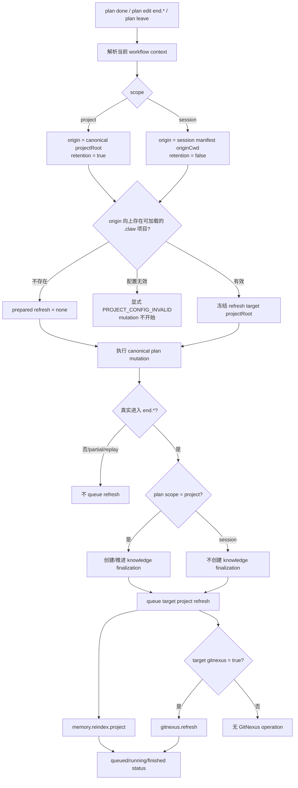

# 2026-08-20 1542 解耦计划范围与项目刷新

## 设计状态

- **status:** `ready`
- **openDecisions:** 无。现有代码、Truth/ADR 与用户约束足以确定最小实现边界。

## 问题、范围与非目标

### 问题

当前 CLI 把两个不同问题错误地绑定在同一个 `scope === "project"` 判断上：

1. 终态 plan 是否应创建 knowledge-finalization job；
2. 终态 plan 所在工作环境是否有一个可刷新的 claw 项目。

这导致显式 `scope: "session"` 的 plan 即使源自一个有效 claw 项目，也不会排队 project memory / GitNexus refresh。内部 knowledge writer 正是 session-scoped claw plan，因此这条 gate 会让其自身 `plan done` 无法承担项目刷新。与此同时，无 `.claw` 的普通 session workflow 确实不应产生任何项目刷新。

### 范围

- 将 **plan scope** 与 **project refresh eligibility** 解耦。
- 所有从非 `end.*` 成功进入 `end.completed | end.closed | end.leave` 的 plan，都经过同一个 terminal refresh dispatcher。
- project-scope plan 与“来源目录位于有效 claw 项目内”的 session-scope plan 都可刷新该项目。
- project memory refresh 沿用现有 `memory.reindex.project`；只有 effective project config 的 flat `gitnexus === true` 时才加入 `gitnexus.refresh`。
- `scope` 继续只控制 knowledge report / registry / job / `knowledgeDispatch` 等 finalization side effects。
- 补齐 `plan done`、`plan edit --status end.*` 与 `plan leave` 的一致入口。

### 非目标

- 不改变 plan/session 存储位置、session TTL、binding 或 subplan parent-resume 语义。
- 不让无 `.claw` 的 session workflow 初始化项目、创建 refresh status 或访问其他项目。
- 不改变 GitNexus 安装、setup、embeddings 自愈、single-flight、Windows recovery 或 detached worker 内部实现。
- 不改变 knowledge writer 的 assignment、claim/done token、launcher policy 或 Truth/ADR 沉淀资格。
- 用户随后确认：knowledge writer 应通过其自身的 canonical `plan done` 触发最后一次索引刷新，不再以 `claw direct` 作为 workaround。本次实施将相应更新 template；`knowledge done` 的既有 memory-only 后置请求保留为兼容路径。

## 现状证据与参考资料

### 当前代码事实

- `packages/cli/src/cli.ts:preparePlanEndFinalization`（当前锚点约 4010 行）先调用 `resolveWorkflowProjectContext(...)`，然后在 `workflowProject.scope !== "project"` 时直接返回 `undefined`。这是 session plan 缺失 refresh 的直接原因。
- 同文件 `queueCompletionRefresh`（约 4016 行）才是真正的 project refresh owner：它始终声明 `memory.reindex.project`，并仅在 `project.projectConfig?.gitnexus === true` 时加入 `gitnexus.refresh`；它还拥有 status file、detached launcher 与 project single-flight。
- `packages/cli/src/cli.ts:runPlan` 的 `plan done` 与 ordered `plan edit --status end.*` 在 mutation 成功后调用上述回调；`packages/cli/src/cli.ts:runPlanLeave`（约 1777 行）目前直接进入 `end.leave`，却没有调用 completion refresh dispatcher。这与 Truth 中“所有 `end.*` 共用收尾边界”的描述不一致。
- `packages/core/src/plan.ts:542-596` 用 `enteredEndTerminal = !isEndTerminal(previousStatus) && isEndTerminal(next.status)` 定义真实终态转换，并只在 `task.project.scope === "project"` 时调用 `tryEndKnowledgePlan`。这个 scope gate 属于 knowledge finalization，应该保留。
- `packages/core/src/knowledge-sidecar.ts:240-290` 的 `tryRegisterKnowledgePlan` 与 `tryEndKnowledgePlan` 都在 session scope 时成功 no-op；`tryCaptureKnowledgeStop`、job listing 也保持同样边界。这已经是 scope 控制 finalization 的单一正确 owner。
- `packages/core/src/session-workflows.ts:35-50,71-85,129-141` 将 session manifest 的 `originCwd` 投影为 session context 的 `projectRoot`，同时把 plan state 放在用户级 session runtime。该 `originCwd` 可以安全地用于重新发现 plan 的来源项目，而不应使用完成命令偶然所在的其他 cwd。
- `packages/core/src/context.ts:23-44,171-193` 的 `resolveProjectContext` 从 cwd 向上找到 `.claw`，加载 canonical config 与 override；不存在项目时抛 `CLAW_DIR_NOT_FOUND`，配置解析失败时抛 `PROJECT_CONFIG_INVALID`。`packages/cli/src/cli.ts:tryResolveHookProject` 只把前者转成 `null`，不会把坏配置伪装成“无项目”。
- `packages/cli/test/cli-session-scope.test.ts:156-194` 只覆盖了“session plan 来源 cwd 无 `.claw` 时不创建 refresh”，没有覆盖“session plan 来源 cwd 位于有效 claw 项目时应刷新”。
- `packages/cli/test/cli-closeout.test.ts` 已覆盖 project-scope `plan done` 的 disabled/enabled GitNexus、detached dispatch、安装失败、自愈和 single-flight，但没有锁定 in-project session plan 的 refresh 合同，也没有直接覆盖 `plan leave` shortcut 的 dispatcher。
- GitNexus 索引在调查时报告 indexed commit 与 current commit 同为 `dd94a07`。`gitnexus context` 确认 `preparePlanEndFinalization -> queueCompletionRefresh`，其唯一直接调用者为 `runPlan`；impact 分析把上游影响限定在 `runPlan -> main` 的 CLI 路径。语义查询不足之处已用上述精确源码锚点补全。

### 已接受的项目决策

- `.claw/truth/adr/hook-owned-two-phase-knowledge-finalization.md:13-31`：session scope 不创建 finalization job 或 `knowledgeDispatch`；所有非终态到 `end.*` 的转换才是 lifecycle trigger；foreground plan 与异步 writer/refresh 失败相互独立。
- `.claw/truth/adr/project-json-drives-memory-and-gitnexus.md:20-44`：flat `gitnexus` 是唯一 claw-side gate；refresh 在 detached worker 中执行；terminal result 不等待 GitNexus；single-flight 与精确 Windows recovery 保持不变。
- `.claw/truth/adr/plan-mutations-use-explicit-command-fields.md:14-32`：`plan done` 只是 ordered plan edit shortcut；请求 `end.*` 的入口应共享 dispatcher；`end.completed`、`end.closed`、`end.leave` 应保持相同收尾边界。
- `.claw/truth/features/local-claw-cli.md:74-89` 与 `.claw/truth/features/project-schema-alignment.md:73-75` 记录了当前 project-scope refresh 与 GitNexus gate，但把 refresh eligibility 写成 project scope；本设计需要把该陈述更新为“存在有效 refresh target project”，并保留其余 worker 合同。

## 领域模型、术语、不变量与唯一 owner

### 术语

| 概念 | 定义 | 唯一 owner |
| --- | --- | --- |
| Plan scope | plan state 存放及 knowledge finalization 隔离策略，值为 `project` 或 `session` | `ProjectContext.scope`、`session-workflows.ts`、`knowledge-sidecar.ts` |
| Workflow origin | session workflow 创建时冻结在 manifest 的 `originCwd`；project workflow 则为 canonical project root | `session-workflows.ts` |
| Refresh target project | 在 terminal mutation 前，从 workflow origin（project plan 为自身 project root）向上解析出的、配置可加载的 claw project | CLI terminal refresh preparation |
| Terminal transition | plan 从非 `end.*` 成功进入任一 `end.*`，不是“命令参数中出现过 end 字符串” | `core/plan.ts` 的 `enteredEndTerminal` 语义 |
| Knowledge finalization | report/registry/job/assignment/`knowledgeDispatch` 生命周期 | `knowledge-sidecar.ts` 与 knowledge assignment owner |
| Completion refresh | project memory reindex、可选 GitNexus analyze、status file 与 single-flight | `cli.ts:queueCompletionRefresh` 及 detached worker |

### 不变量

1. `scope === "session"` 永远不创建 knowledge registry、finalization job 或 `knowledgeDispatch`。
2. Refresh eligibility 不读取 plan scope 作为 allow/deny gate；它只回答是否存在一个有效的 refresh target project。
3. 无 `.claw` 的 session workflow 成功完成且不创建 refresh status file、不启动 worker、不初始化项目。
4. session workflow 只能刷新其 **workflow origin** 所属项目；不能因完成命令从另一个 cwd 运行而刷新偶然命中的其他项目。
5. 只有真实 terminal transition 成功后才排队 refresh。operation chain 在到达 terminal status 前失败、仍是 process 状态或重复写入既有终态，都不产生新请求。
6. session plan 的刷新不运行 project task retention。否则同名 session task 可能误归档真实 project task；project plan 继续保留现有 retention。
7. 每个 refresh target 的 flat `gitnexus === true` 是加入 `gitnexus.refresh` 的唯一条件；plan template/config override 不创建第二个 GitNexus gate。
8. Detached refresh 失败写入 status file，不回滚已持久化的 terminal plan；不存在项目则是正常 ineligible，而 malformed project config 必须保持可见，不能伪装成 no-project。

## 技术决策及每项决策的原因

### 1. 用 Prepared Refresh Target 取代 scope gate

将 `preparePlanEndFinalization` 收窄并重命名为表达真实职责的 helper（建议 `preparePlanTerminalRefresh`）。它在 mutation 前冻结：

```ts
type PreparedPlanTerminalRefresh = {
  projectRoot: string;
  includeTaskRetention: boolean;
  queue(taskName: string): CompletionRefreshResult;
};
```

解析规则：

- project workflow：refresh discovery cwd 为 workflow `projectRoot`，`includeTaskRetention = true`；
- session workflow：refresh discovery cwd 为 session manifest 的 `originCwd`（当前投影为 workflow `projectRoot`），`includeTaskRetention = false`；
- discovery 找不到 `.claw`：返回 `undefined`；
- discovery 命中但 config 无法解析：传播现有 `PROJECT_CONFIG_INVALID`。

原因：refresh target 是环境/项目事实，不是 plan storage policy。mutation 前冻结可以避免 terminal transition 解绑 session 后丢失 origin，也避免完成期间 cwd 或 binding 改变造成 TOCTOU 选错项目。

### 2. 以实际状态转换决定是否 queue

CLI 仍可在 mutation 前 prepare target，但必须在 `editPlan` 返回后，用 `previousPlan.status` 与最终 `result.plan.status`（或 Core 显式返回的等价 transition flag）确认真实 `enteredEndTerminal`，再调用 `queue(...)`。不要继续仅凭 `requestsPlanEndTerminal(operations)` 判断。

原因：ordered operation chain 可以 partial failure；请求过 terminal status 不等于成功到达 terminal。该决定与 Core 的 finalization trigger 对齐，并让重复 `plan done` 保持幂等。

### 3. 所有 terminal command surface 共用同一 dispatcher

`plan done`、`plan edit --status end.*`、`plan leave` 都使用同一个 prepare/commit helper。若后续新增 `plan close` alias，也必须复用该 helper，不新增分支。

原因：现有 Truth 已声明各终态共享收尾边界，而 `runPlanLeave` 当前实现漏接 dispatcher。统一入口避免同类漏洞再次出现。

### 4. Session refresh 明确关闭 project task retention

session target 调用 `queueCompletionRefresh` 时传 `includeTaskRetention: false`；project target 沿用默认 `true`。refresh operations 与 status lifecycle 不另起实现。

原因：session task 不存在于 project `.claw/tasks`。让它驱动 project retention 既没有业务意义，也存在 taskName 碰撞导致误归档的风险。

### 5. 保留现有 detached worker、GitNexus gate 与 single-flight

不新增 GitNexus 调用、不在 plan mutation 内同步 analyze。仍由 `queueCompletionRefresh` 从 target project effective config 构造 operations，由 `internal-completion-refresh` 执行。

原因：现有 worker 已拥有失败可观察性、Windows launcher、coalescing、embedding self-heal 与精确 crash recovery；复制会产生第二套状态机和锁。

### 6. 由 knowledge writer 的 canonical plan completion 承担最终刷新

内部 knowledge writer 是 session plan，因此本设计落地后，其 terminal transition 会自然请求 origin project refresh。template task 7 保留为显式的最终索引检查点，但不再调用 `claw direct`；完成该 task 后的 canonical `claw plan done` 是唯一正式队列入口。`knowledge done` 的既有 memory-only 后置请求保留为兼容路径。

原因：`claw direct` 是无正式 plan 的兼容入口，不应承担 writer 的正式收尾职责。canonical terminal dispatcher 已拥有 origin 归属、可观测 status 和 single-flight 语义。

## 协作合同：入口、状态变化、事件或投影、失败与重试语义



### 入口合同

- 输入：当前 cwd、owner session key、目标 plan、terminal mutation。
- prepare 输出：`PreparedPlanTerminalRefresh | undefined`，其中 target project root 与 retention policy 已冻结。
- commit 条件：canonical mutation 成功，且 previous status 非终态、result status 为终态。
- 成功输出：现有 compact command result 可选包含 `completionRefresh`；session plan 仍不得出现 `knowledgeDispatch`。

### 状态变化与投影

- canonical plan 状态由 Core mutation 唯一写入。
- knowledge job 状态只在 project scope 变化；session scope 无此状态机。
- refresh status 继续使用 `.claw/logs/completion-refresh/*.json` 的 `queued -> running -> finished` 投影。
- `operations` 至少含 `memory.reindex.project`；仅 target project 的 flat `gitnexus` 为 true 时含 `gitnexus.refresh`。
- 本次不新增 durable event/schema；CLI JSON 的 `completionRefresh` 是 refresh request 的只读投影。

### 失败、不变性与重试

| 失败点 | 可见结果 | 必须保持不变 |
| --- | --- | --- |
| origin 无 `.claw` | 正常无 `completionRefresh` | session plan 可完成；不创建 `.claw` 或 project log |
| `.claw/project.json` 无法解析 | 现有 `PROJECT_CONFIG_INVALID` | 不把错误降级成 no-project；prepare 在 mutation 前失败 |
| plan mutation/operation chain 未进入终态 | 原有 mutation error/partial result | 不创建 refresh；knowledge finalization 同样不触发 |
| detached launcher 排队失败 | 沿用当前 CLI/diagnostic 行为 | 已成功写入的 terminal plan 不被回滚 |
| memory/GitNexus worker 失败 | status file `ok:false` 与具体错误 | terminal plan 与 knowledge job 不回滚；允许后续 terminal/`claw direct`/worker retry 请求 |
| 并发或重复 refresh | follower status 指向 leader，operations 取并集 | 每个 target project 仍只有一个 active flight；GitNexus 不并发 analyze |

## 备选方案、取舍与重新评估条件

### 方案 A：只删除 `scope !== project` 判断，直接用当前 cwd queue

- 收益：改动最小。
- 代价/风险：跨 cwd 恢复的 session plan 可能刷新一个无关项目；session taskName 还可能触发 project task retention。
- 结论：拒绝。它违反 origin ownership 与“不误刷新普通 session”边界。

### 方案 B：在 session manifest 增加 `refreshProjectRoot` 字段

- 收益：关联显式、无需完成时重新查找。
- 代价/风险：引入 manifest schema 迁移、旧 session 兼容和项目移动/删除后的 stale path；当前已有 `originCwd` 足以无歧义发现来源项目。
- 结论：暂不采用。
- 重新评估条件：未来允许 session 在多个项目间迁移，或 workflow origin 不再能代表工作归属。

### 方案 C：把 refresh 移入 knowledge finalizer/Stop hook

- 收益：知识写入之后刷新看似自然。
- 代价/风险：session scope 没有 finalization；无知识变更的 plan 仍需刷新代码索引；background/subagent/host 差异会再次造成漏路。
- 结论：拒绝。refresh 属于 terminal project maintenance，不属于 knowledge lifecycle。

### 方案 D：立即删除 writer template 的 `claw direct` 与 `knowledge done` refresh

- 收益：减少重复请求。
- 代价/风险：需要同时证明所有 host/runner/fallback 路径必然完成 session plan terminal transition；当前证据不足以安全扩大变更。
- 结论：保留为后续优化。
- 重新评估条件：Codex、OpenCode、Cindy 的真实 E2E 均证明 terminal dispatcher 覆盖，且 status telemetry 显示旧请求仅为冗余。

## 实施切片、迁移或兼容边界、验证证据

### 切片 1：抽出并接入 refresh target preparation

- 在 `packages/cli/src/cli.ts` 将 `preparePlanEndFinalization` 改为 scope-agnostic 的 terminal refresh preparation。
- session 使用 `resolveWorkflowProjectContext(...).projectRoot`（即 manifest origin）发现项目；不要使用偶然的 command cwd。
- 将 `includeTaskRetention` 固化到 prepared target。
- 不修改 `packages/core/src/knowledge-sidecar.ts` 的 session gates。

### 切片 2：统一真实 terminal transition dispatch

- `plan done` 与 ordered `plan edit` 在成功 mutation 后按 previous/final status 判断是否 queue。
- `runPlanLeave` 接入相同 prepare/commit 路径。
- partial chain、process status、重复终态不 queue。
- 若为 subplan closure，refresh eligibility 以实际结束的 source plan transition 为准，project target 仍是 workflow origin；不要因 parent resume 改变 target。

### 切片 3：聚焦回归测试

优先扩展 `packages/cli/test/cli-session-scope.test.ts` 与 `packages/cli/test/cli-closeout.test.ts`：

1. **in-project session + gitnexus=true**：session `plan done` 返回 queued refresh，operations 含 memory 与 GitNexus；无 knowledge job/dispatch；project task retention 未运行。
2. **in-project session + gitnexus=false**：只含 memory；不得调用 GitNexus shim。
3. **no-project session**：保留现有 `lightweight session plan completion...`，断言无 `completionRefresh`、无项目 logs、无 `.claw`。
4. **origin safety**：session 在项目 A 创建，从项目 B 或无项目 cwd 完成，只刷新 A；不得在 B 生成 refresh status。
5. **taskName collision**：project 中存在与 session task 同名的已终态 task，session completion 不得归档/删除该 project task。
6. **terminal surfaces**：`plan done`、`plan edit --status end.completed|end.closed|end.leave`、`plan leave` 都覆盖 project 与 in-project session 路径。
7. **actual transition**：operation chain 在 terminal op 前 partial failure、最终仍为 process、重复 terminal replay 均不新增 status file。
8. **config failure**：origin 命中 `.claw` 但 project config malformed 时返回 `PROJECT_CONFIG_INVALID`，且 plan 状态未改变。

现有 GitNexus install/setup/analyze、Windows crash recovery、single-flight 与 worker failure 测试无需重写，只需证明新 session 入口复用了同一 `queueCompletionRefresh`。

### 文档与兼容迁移

- 更新 `.claw/truth/adr/project-json-drives-memory-and-gitnexus.md`、`.claw/truth/adr/plan-mutations-use-explicit-command-fields.md`、`.claw/truth/features/local-claw-cli.md`、`.claw/truth/features/project-schema-alignment.md`：把“project-scope terminal plan”收窄为“terminal plan with a valid refresh target project”，并明确 scope 仅控制 finalization。
- session manifest、project config、status file 与 CLI operation names 均不需要 schema migration。
- 旧 session manifest 已含 `originCwd`，可以直接兼容；来源目录不再存在或不再属于 claw 项目时自然成为 no-refresh。
- 不改变 flat `gitnexus` 配置，也不恢复 legacy `gitnexus.enabled`。

### 完成证据

实施完成必须同时提供：

- 聚焦 CLI 测试通过，覆盖上述三类 eligibility（project plan、in-project session、no-project session）与三种终态入口；
- 断言 session completion 没有 knowledge finalization artifacts/dispatch；
- 断言 `gitnexus=false` 无 GitNexus operation，`gitnexus=true` 只有 detached worker 调用；
- 断言 origin safety 与 retention collision；
- 现有 closeout/single-flight 测试保持通过；
- 对修改后的 Truth/ADR 做 focused `claw search` 与精确 `rg` 复核，确保不再残留“session scope 一律不 refresh”的 current claim。
