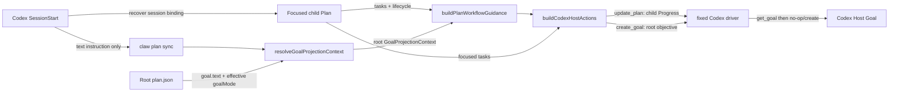

# 2026-08-21 1631 Codex 子计划恢复期间保持根 Goal

## 状态

`ready`

开放决策：无。现有存储 ADR、SessionStart 恢复合同、Codex fixed-driver 幂等合同与当前代码已经足以确定 owner 和最小实现边界。

## 问题、范围与非目标

### 问题

Codex 的 session binding 在创建 subplan 后会正确切换到 child plan；SessionStart 也会正确恢复该 child 作为当前 workflow。然而 Codex Goal 是 thread-level 状态，当前产品语义要求 subplan 执行期间继续保留 parent/root Goal，而不是把 child `goal.text` 提升为新的 thread Goal。

当前 `plan sync` 把恢复出的 focused child 直接传给 `buildPlanWorkflowGuidance()`，并用 `recoveryResync: true` 强制 active Goal reconciliation。`buildPlanWorkflowGuidance()` 又直接用 focused plan 的 `goal.text` 生成 `create_goal`。因此，只要 Host 中原有 root Goal 已缺失或已终态，fixed driver 就会忠实地创建 child Goal。SessionStart 本身没有创建 Goal；它只是稳定触发了这条错误的 `plan sync -> child objective -> create_goal` 路径。

### 范围

- 明确 root plan、focused plan、Codex thread Goal 与 Progress projection 的 owner。
- 让 root plan 执行期间及任意层 subplan 执行期间，Codex Goal 的推荐 objective 始终来自 canonical root plan。
- 保持 SessionStart 只注入恢复提示、fixed driver 只消费 CLI `hostActions` 的既有边界。
- 修复 `plan sync`，并同时封住其他 active child mutation 在 Goal 缺失时创建 child Goal 的同源缺口。
- 保持 child plan 继续拥有当前任务、当前 lifecycle 和 Codex Progress projection。
- 保持 `goalMode = false`、session scope、opencode、Cindy 与当前 fixed-driver 幂等规则。

### 非目标

- 不让 plugin、CLI 或 Agent 接管 Codex Host 的 Goal runtime；Host 仍拥有真实 Goal 状态。
- 不新增 `rootGoal`、`goalOwner` 等持久化镜像字段，不修改 `plan.json` schema 或 session registry schema。
- 不在 SessionStart hook 内直接调用 `get_goal`、`create_goal`、`update_goal` 或 `update_plan`。
- 不根据 Host error text 做补偿，不让 Agent 单独检查 Goal。
- 不自动替换已经 active 的旧版 child Goal；现有“保留 active Goal”安全边界继续优先。
- 不改变 subplan focus、完成返回、retention、knowledge finalization 或跨 host plan lifecycle。

## 现状证据与参考资料

### 已接受的项目合同

- task 存储合同规定 root 固定为 `plan.json`，subplan 平铺存储；session binding 在 subplan create 后指向 child，subplan done 后指回 parent。见 `.claw/truth/adr/task-plan-storage-and-session-binding.md:13-18`、`:27-32`。
- SessionStart 只按 `sessionKey -> planPath` 恢复当前 plan，不扫描目录猜测；恢复 active Codex workflow 时，它只注入文本并要求 fixed driver 运行一次只读 `plan sync`。见 `.claw/truth/adr/session-start-restores-session-bound-workflow.md:30-38`、`:56-65`。
- Codex Goal 是 thread-level Host feature；CLI 提供 plan-derived objective 和调用策略，但不拥有 Host Goal runtime。见 `.claw/truth/adr/codex-goal-mode-thread-contract.md:22-39`。
- fixed driver 在每次 Goal mutation 前调用 `get_goal`：active Goal 存在时保留，Goal 不 active 时才执行 `create_goal`；canonical mutation 不因 Host action 失败而回滚或重放。见 `.claw/truth/adr/codex-plan-mutations-use-fixed-code-mode-consumer.md:23-45`、`:76-88`。

### 当前代码链路

- `PlanDocument.parentPlan` / `parentTaskId` 表达 subplan 导航关系，root 与 child 各自仍有 `goal.text`。见 `packages/core/src/types.ts:125-147`。
- `writePlan()` 创建 child 时把 `parentPlan` 写入 child，并把 session binding 切到 child；root/parent 文件没有被复制进 binding。见 `packages/core/src/plan.ts:135-170`。
- `tryResolveActiveWorkflowSnapshot()` 只从 session binding 读取 focused plan，并将该 plan 作为 SessionStart 的 `activeWorkflow.planContent`。见 `packages/cli/src/cli.ts:3352-3408`。
- 两个 Codex SessionStart surface 都在 recovered plan 为 `process.active` 时要求运行 `claw plan sync`，但没有 Goal-owner 信息。见 `packages/cli/src/cli.ts:3118-3137` 与 `packages/codex-adapter/scripts/session-start.mjs:39-48`。
- `runPlanSync()` 对当前 bound plan 调用 `showPlan()`，再把同一个 plan 传给 `buildPlanWorkflowGuidance()`；它用假设的 `previousStatus: "process.wait"` 与 `recoveryResync: true` 强制恢复。见 `packages/cli/src/cli.ts:1823-1849`。
- active guidance 的 Goal reconciliation 使用 `plan.goal.text`；`recoveryResync` 或任意 command source 都会生成 `goalTool=create_goal`。见 `packages/core/src/workflow-guidance.ts:322-374`、`:474-541`。
- `buildCodexHostActions()` 把当前 plan 投影为 `update_plan`，并把 guidance 中的 `goalTool.objective` 原样投影为 `create_goal`。见 `packages/cli/src/codex-host-actions.ts:8-75`。
- fixed driver 只区分 Host Goal 是否 active；如果缺失或终态，它会执行 CLI 给出的 objective，不知道该 objective 属于 root 还是 child。见 `packages/cli/src/codex-driver.ts:138-178`。

### 已验证的缺陷复现

在当前 `packages/cli/dist/cli.js` 上，用独立 thread id 创建目标为 `ROOT OBJECTIVE` 的 root plan，再创建目标为 `Child Work: CHILD OBJECTIVE DETAIL` 的 child 并把 child 置为 `process.active`：

- child activation 返回 `update_plan` 后跟 `create_goal("...Child Work: CHILD OBJECTIVE DETAIL")`；
- 同一 session 的 `plan sync --host codex` 仍返回 child Progress 与同一个 child `create_goal` objective；
- 因此 Host Goal 已缺失时，fixed driver 会实际创建 child Goal；Host Goal 仍 active 时则因 driver 幂等保护而暂时掩盖缺陷。

该结果与上述源码链路一致，不依赖 Host error text。

### 文档冲突

当前源码与测试已改成 subplan create 不关闭 root Goal：`packages/core/src/workflow-guidance.ts:172-183` 的 note 明确写 root Goal remains active；`packages/cli/test/cli-host-actions.test.ts:706-728` 断言 subplan create 只有 `update_plan`，没有 `update_goal` / `create_goal`。

但现有 Truth/ADR 仍描述旧的 parent complete -> later child create handoff：`.claw/truth/features/codex-goal-mode-integration.md:38-43` 与 `.claw/truth/adr/codex-goal-mode-thread-contract.md:35-38`。实现时必须同步修正这些 owner 文档，不能让旧 handoff 继续作为“当前事实”。

### GitNexus 关系证据

项目配置启用 GitNexus（`.claw/project.json:29`）。GitNexus 将 `runPlanSync` 定位为 `showPlan -> buildPlanWorkflowGuidance -> compactPlanCommandResult` 的入口，并将 `buildCodexHostActions` 定位为 stateless CLI 与 session command service 共用的唯一 projector；精确调用方随后由上述源码锚点确认。GitNexus 对纯文本 Goal 语义和 config 分支证据不足，因此这些部分使用 `claw search` 与 `rg`/精读补足。

## 领域模型、术语、不变量与唯一 owner

### 术语与 owner

| 概念 | 定义 | 唯一 owner / 单一事实来源 |
| --- | --- | --- |
| Root Plan | 一个 task 的顶层计划；当前存储合同下固定为该 task 的 `plan.json` | root `PlanDocument` |
| Focused Plan | session binding 当前指向、Agent 正在执行或恢复的 plan；可为 root 或任意 child | session registry 的 `sessionKey -> planPath` |
| Plan Goal | 每个 plan 自己的 canonical `goal.text`，服务该 plan 的计划内容 | 对应 `PlanDocument.goal.text` |
| Thread Goal Subject | 当前 Codex thread Goal 应代表的业务目标 | active task 的 Root Plan Goal |
| Goal Projection Context | 从 canonical root plan 临时派生的 Host projection 输入，不持久化 | core plan orchestration resolver |
| Host Goal State | Codex 中真实 Goal 的 active/terminal/absent 状态 | Codex Host；fixed driver 只在 mutation 紧前方读取 snapshot |
| Progress Projection | composer 上方当前执行步骤的只读镜像 | Focused Plan tasks 经 `buildCodexPlanProjection()` 派生 |

### 不变量

1. 同一 task 的 root 与所有 descendants 在同一 Codex thread 中共享一个 Thread Goal Subject：root `plan.json` 的 `goal.text`。
2. Focused Plan 变化不改变 Goal owner；subplan focus 是执行视图切换，不是 thread objective handoff。
3. child 的 `goal.text` 仍是 child plan 的 canonical 业务内容，但不得直接成为 Codex `create_goal` objective。
4. lifecycle action 由 Focused Plan 状态驱动：child wait 可以结束当前 root Goal，child resume/sync 可以恢复它；恢复时 objective 仍来自 root。
5. Progress 始终投影 Focused Plan，不把 root tasks 错投影到 child 执行界面。
6. 若 Host 中已有 active Goal，fixed driver 保留它；不得因 objective 不同而在同一 call 内 complete -> create。
7. 若 Host Goal absent/terminal 且 goal mode 启用，任何被允许的 child reconciliation 只能创建 root Goal。
8. root plan 缺失、不可读、`goal.text` 为空或 root 自己带 `parentPlan` 时必须显式失败；不得退回 child objective 或空/default objective。
9. Goal Projection Context 是派生读模型，不写入 root、child、session binding 或 runtime registry，避免第二份可编辑业务真相。
10. `scope === "session"`、opencode、Cindy 与 root effective `goalMode === false` 继续 suppress Codex Goal actions。

## 技术决策及每项决策的原因

### 1. 引入运行时 `GoalProjectionContext`，分离 focused plan 与 Goal owner

在 core plan orchestration 内定义最小的派生值，建议形状：

```ts
type GoalProjectionContext = {
  ownerPlanFile: string;
  objective: string;
  enabled: boolean;
};
```

`ownerPlanFile` 用于诊断与测试，不进入 schema-v1 Host action；`objective` 是已验证的 root goal 文本；`enabled` 使用 root plan 的 effective config 计算。

原因：当前缺陷不是 Host 幂等问题，而是 CLI 在产生 action 前选择了错误的业务 owner。把 owner 显式建模，能让 `workflowGuidance`、stateless CLI 与 session command service 复用同一结论，同时避免在 projector 或 driver 中读文件、猜 lineage。

### 2. 在 core 中建立单一 root resolver，不新增持久化字段

新增一个 plan/task 内部 resolver（命名可为 `resolveGoalProjectionContext`），输入 project/task context 与 focused plan，规则为：

- focused plan 无 `parentPlan`：它本身就是 root；
- focused plan 有 `parentPlan`：读取同一 task directory 固定的 `plan.json`；
- 验证 root 文件位于 task directory 内、可规范化、没有 `parentPlan`、`goal.text` 非空；
- 用 `resolvePlanEffectiveConfig(projectConfig, rootPlan)` 计算 `enabled`；
- 返回派生 context，不修改任何文件。

原因：accepted storage contract 已把 root 固定为 `plan.json`，无需新增 lineage cache、扫描 task directories 或沿 parent chain 维护另一套 owner 状态。即时读取还能让 root goal 的合法更新在下一次 reconciliation 中生效。

### 3. `buildPlanWorkflowGuidance()` 使用 Goal context，而不是默认使用 focused `plan.goal.text`

给 `buildPlanWorkflowGuidance()` 增加可选的明确 Goal projection 输入。规则：

- root plan 调用可显式传 root context，或安全地从当前 plan 派生；
- child plan 未提供 Goal context 时，Goal 字段 fail closed/suppress，绝不能隐式退回 child `goal.text`；
- `goalMode.recommendedObjective` 与 `goalTool.objective` 都用 `GoalProjectionContext.objective`；
- stage、nextTask、notes、command hints、wait/resume 判定仍用 Focused Plan；
- Progress predicate `shouldUsePlanHostIntegration()` 仍用 Focused Plan。

原因：Goal objective 与 plan lifecycle 在一个 guidance 构造点汇合，但 owner 不同。显式 context 保持该函数可测试，也把“忘记为 child 解析 root”变成可见失败，而不是静默创建 child Goal。

### 4. 所有会生成 Codex Goal action 的 plan 路径共用 resolver

至少覆盖：

- `writePlan()` / `editPlan()` 返回的 `workflowGuidance`；
- stateless `runPlanSync()`；
- `ClawCommandService.codexActionsForPlan()` 与 mutation path；
- subplan create、child activation、child wait/resume、child ordinary mutation、child recovery sync。

对有 canonical mutation 的路径，应在提交前完成 root context preflight；若 root owner 无效，零提交失败。`plan sync` 是只读操作，直接在产生任何 Host action 前失败。

原因：只特判 SessionStart 会留下同源缺口——例如 Goal 丢失后用户先执行 child `task edit`，当前“每次 active mutation reconcile”仍会创建 child Goal。owner resolution 必须位于共享 plan orchestration 层。

### 5. root effective config 管 Goal，focused plan 管自身 workflow 与 Progress

`GoalProjectionContext.enabled` 必须由 root plan effective config 计算。project/personal override 仍包含在 project context；root template override 决定这个 root Goal 是否启用。child template 的 `goalMode` override 不得关闭、切换或改写 root Goal。

原因：配置跟随其所控制的 owner。否则 child template 会成为第二个 root Goal policy writer，与“root Goal remains active”不变量冲突。

### 6. SessionStart 继续只触发 sync，但文案明确 root Goal 语义

保留 `activeWorkflow.planStatus === "process.active" -> run plan sync once`。将 Codex 两处提示统一为类似：

> restore focused-plan progress and reconcile the root-plan Goal

不把 objective 或 root plan 内容复制到 SessionStart payload，也不增加 hook Host-tool capability。

原因：SessionStart 只负责恢复入口，canonical owner resolution 应由 CLI 在执行 `plan sync` 时完成；这样 compact、resume、startup 使用同一确定性路径。

### 7. fixed driver 与 schema-v1 action 不变

`buildCodexHostActions()` 仍消费 `workflowGuidance.goalTool`；driver 仍在 action 紧前方读取 `get_goal` 并保留 active Goal。只要 action objective 已在 upstream 修正，driver 不需要读取 plan 文件、识别 root/child 或新增 `ensure_goal`。

原因：driver 的唯一 owner 是 Host 状态幂等与 action 消费，不是业务 plan lineage。此次不改变序列化 driver source，因此不应仅为 CLI action 内容变化 bump driver/cache identity；若实现实际修改 driver source，则必须按既有合同同步 bump。

## 协作合同：入口、状态变化、事件或投影、失败与重试语义

### 正常数据流



### 生命周期合同

```mermaid
stateDiagram-v2
    [*] --> RootActive: root enters process.active / create root Goal
    RootActive --> ChildFocused: subplan create / retain root Goal
    ChildFocused --> ChildFocused: child mutation / reconcile root Goal
    ChildFocused --> RootGoalMissing: Host Goal absent or terminal
    RootGoalMissing --> ChildFocused: SessionStart + plan sync / create root Goal
    ChildFocused --> ChildPaused: child enters wait/discussing / complete root Goal
    ChildPaused --> ChildFocused: child resume / create root Goal
    ChildFocused --> RootActive: child completes / focus returns; do not create child Goal
    RootActive --> [*]: root end.completed / complete root Goal
```



### 入口与结果矩阵

| 入口 | Focused Plan | Host Goal 前态 | Progress action | Goal action |
| --- | --- | --- | --- | --- |
| root active mutation/sync | root | active | root projection（若需要） | driver 保留 active |
| root active mutation/sync | root | absent/terminal | root projection（若需要） | create root objective |
| subplan create | child discussing/prepare | root active | child projection（若需要） | 无；保留 root |
| child enters/continues active | child | root active | child projection（若需要） | create intent 携带 root objective；driver no-op |
| child enters/continues active | child | absent/terminal | child projection（若需要） | create root objective |
| child wait/discussing | child | root active | 按现有规则 | complete root Goal |
| child resume/sync | child | absent/terminal | child projection | create root objective |
| child completion returns parent | parent | root active | parent projection（现有合同） | 不创建 child Goal |

### 失败不变性

| 失败 | 必须可见的结果 | 保持不变的状态 |
| --- | --- | --- |
| root `plan.json` 缺失/越界/JSON 无效 | 明确 owner-resolution error；不得产出 Host actions | Host Goal 与 Progress 不变；`plan sync` 零写入 |
| root `goal.text` 为空或 root 带 `parentPlan` | 明确 invariant error；不得 fallback 到 child | 不创建 child Goal |
| root goal mode disabled | 正常成功但无 Goal action | Host Goal 不被 CLI 改写；Progress 仍按 focused plan 规则同步 |
| `get_goal` 不可用 | fixed driver fail closed | canonical plan mutation可能已提交；Host action不伪装成功 |
| `update_plan` 或 `create_goal` transport 失败 | 显式 Host-action failure | 不重放 canonical mutation；后续用只读 `plan sync` 恢复 |
| 已有 active Goal（包括旧版本误建 child Goal） | driver 返回既有 recovery note/no-op | 不覆盖、不 complete->create；避免破坏用户/Host active Goal |

### 重试语义

- `plan sync` 只读且 action id 由当前 plan path 派生，可安全重新运行；每次都重新读取 canonical root context 与即时 Host Goal snapshot。
- root owner preflight 失败时，修复 root plan 后重试原命令；child objective 不能作为临时 fallback。
- canonical mutation 已提交但 Host action 失败时，不重放 mutation；运行 `plan sync` 以当前 focused plan 恢复 Progress，并以 root context 恢复 Goal。
- active Goal 存在时重试仍是 no-op；fixed driver 的 action-id 至多一次语义继续适用于单次消费。

## 备选方案、取舍与重新评估条件

### 方案 A：只在 child plan 上 suppress Goal action

收益：改动最小，可阻止新 child Goal。

代价：root Goal 丢失后没有恢复路径，SessionStart/plan sync 只能恢复 Progress，直接违背需求。

结论：拒绝。仅 suppress 解决“不要错建”，不能解决“正确恢复”。

### 方案 B：在 `buildCodexHostActions()` 中遇到 child 时临时读取 root 文件

收益：只改 Codex projector，表面集中。

代价：projector 变成带文件 I/O、配置解析和 plan lineage 知识的 owner；stateless CLI 与 session command service 还需各自提供 cwd/task context，且 core `workflowGuidance.goalMode/goalTool` 继续携带错误 child objective。

结论：拒绝。owner 应在 core plan orchestration 中解析，再让 projector 保持纯投影。

### 方案 C：把 `rootGoal` / `goalOwnerPlan` 持久化到 child 或 session registry

收益：恢复时无需读 root 文件。

代价：复制 `plan.json.goal.text` 与 owner 关系，形成第二份可编辑业务状态；root goal 更新、迁移、subplan nesting、session rebinding 都要维护一致性，违反 task storage ADR。

结论：拒绝。root 文件读取成本远小于长期一致性成本。

### 方案 D：比较现有 Host objective，不同就自动替换

收益：可修复旧版已经 active 的 child Goal。

代价：当前 Host 结算语义禁止同 call complete -> create；objective 相同也不能证明 ownership，自动覆盖可能破坏用户手动 Goal。还会扩大 driver schema 与 Host 状态依赖。

结论：当前拒绝。保持 active Goal 优先。

重新评估条件：Codex 提供稳定的 Goal identity/owner metadata，以及原子 replace 或明确跨 call transaction API；届时可设计显式迁移，而不是匹配 objective 文本。

### 方案 E：SessionStart payload 直接携带 root objective

收益：看似能让恢复入口知道 root。

代价：hook snapshot 与 canonical root plan 之间会有时间差；Agent 仍需解释并调度，破坏 fixed-driver 唯一路径。

结论：拒绝。SessionStart 只触发 deterministic `plan sync`。

## 实施切片、迁移或兼容边界、验证证据

### 切片 1：core owner resolver 与纯合同测试

- 在 `packages/core/src/plan.ts` 相邻 owner 中增加 root Goal context resolver；若需跨 package 调用，通过 `packages/core/src/index.ts` 暴露窄接口。
- 覆盖 root plan、一级 child、嵌套 child、root 缺失、root goal 为空、root 非法带 `parentPlan`。
- 验证 resolver 无写入，不修改 plan/session schema。

完成证据：同一 task 任意 descendant 都解析到 `plan.json` 的 objective；非法 root 明确失败且无 fallback。

### 切片 2：guidance 与所有 mutation 入口接线

- 给 `buildPlanWorkflowGuidance()` 增加明确 Goal context；child 缺 context 时 fail closed/suppress Goal fields。
- `writePlan()`、`editPlan()`、`ClawCommandService` 在生成 Goal guidance 前共用 resolver。
- root effective config 控制 Goal；focused plan 继续控制 workflow 和 Progress。
- 保留 `appendSubplanReturnGuidance()` 去除 child completion 的 Goal 字段。

完成证据：

- child activation/ordinary mutation 在 Host Goal 缺失时产出 `create_goal(ROOT)`，从不产出 `create_goal(CHILD)`；
- Host Goal active 时 driver 只消费 child `update_plan` 并保留 Goal；
- child wait -> resume 仍分属两个 calls，resume objective 为 root；
- subplan create/return 不关闭或创建 child Goal。

### 切片 3：SessionStart 与 `plan sync`

- `runPlanSync()` 根据 bound focused plan 解析 root Goal context，再构造 guidance/actions。
- CLI 内建 SessionStart prompt 与 `packages/codex-adapter/scripts/session-start.mjs` 统一为“focused progress + root-plan Goal”措辞。
- 保持 hook 无 Host-tool 调用，保持无 active workflow 时的默认路径不变。

完成证据：恢复 child active workflow 时：

- `update_plan` 输入仍是 child tasks；
- `create_goal` 输入是 root objective；
- root goal mode disabled 时只返回允许的 child Progress；
- root 无效时 sync 显式失败，既不创建 child Goal也不伪装恢复成功。

### 切片 4：Truth/ADR 与 adapter 合同同步

- 更新 `.claw/truth/features/codex-goal-mode-integration.md`，把旧 parent-complete/child-create handoff 改为 root Goal ownership + child recovery reconciliation。
- 更新 `.claw/truth/adr/codex-goal-mode-thread-contract.md`，明确 focused plan 与 Thread Goal Subject 的分离。
- 更新 `.claw/truth/adr/codex-plan-mutations-use-fixed-code-mode-consumer.md` 和 `packages/codex-adapter/references/workflow-guidance-consumption.md`，说明 driver 保留 active Goal，但 CLI objective owner 是 root。
- 更新相关 skill/reference snapshot tests；不要改写无关未提交 Truth 文档。

完成证据：`claw search` 不再把旧“complete parent then create child”作为 current truth 返回；代码、测试、Truth、ADR 对 subplan Goal owner 一致。

### 兼容与迁移边界

- 无持久化迁移、无 schema bump、无 session registry migration。
- 已 active 的 root Goal自然保留。
- 已缺失/terminal Goal在下一次 child mutation 或 SessionStart-triggered sync 中以 root objective 恢复。
- 旧版本已经误建但仍 active 的 child Goal不会被自动替换；它会按现有 lifecycle 在 wait/terminal 时结束，之后下一次恢复创建正确 root Goal。这是安全兼容边界，不应伪装成已即时迁移。
- 如果实现没有修改 fixed driver source，不 bump driver/cache identity；如果修改 source，必须同步 source SHA、version/cache key 与 oracle tests。

### 比例化验证矩阵

1. Core 单元：root context resolution 与 invalid-root fail-closed。
2. CLI contract：复现“root=ROOT、child=CHILD、child active、plan sync”，断言 actions 顺序为 child `update_plan` 后 root `create_goal`。
3. CLI contract：root Goal active snapshot 时，driver 不调用 `create_goal`；Goal terminal/absent 时只调用 root `create_goal`。
4. CLI contract：ordinary child `task edit`、child resume 也只 reconcile root，封住非 SessionStart 同源路径。
5. CLI contract：nested child 始终取 `plan.json`；不取 immediate parent 或 deepest child。
6. Config：root `goalMode=false` suppress Goal；child template override 不接管 root Goal policy；session scope/opencode/Cindy 继续 suppress。
7. Failure：删除/损坏 fixture root 后 child sync 明确失败且无 hostActions。
8. Adapter snapshot：两处 SessionStart wording 一致，仍要求 fixed driver 运行一次 sync。
9. 真实 Host 发布门禁：在未发布本地构建中启动 root Goal，进入 child，显式结束/清空 Host Goal，再触发 compact/resume 的 SessionStart；确认 child Progress 恢复、root objective Goal 变 active、跨 call 结算后仍存在。单元 action shape不能替代该验收。

### 实施完成标准

- 任意 active child 路径都无法生成 child `create_goal` objective。
- root Goal active 时 subplan focus 不扰动它；root Goal缺失时 child recovery 能确定性重建它。
- Progress 与 Goal 分别由 focused plan 和 root plan派生，且没有新增可编辑镜像状态。
- owner resolution 失败可见且 fail closed；已提交 mutation 不被盲目重放。
- 代码、adapter 文案、Truth、ADR、测试与真实 Host 证据一致。
