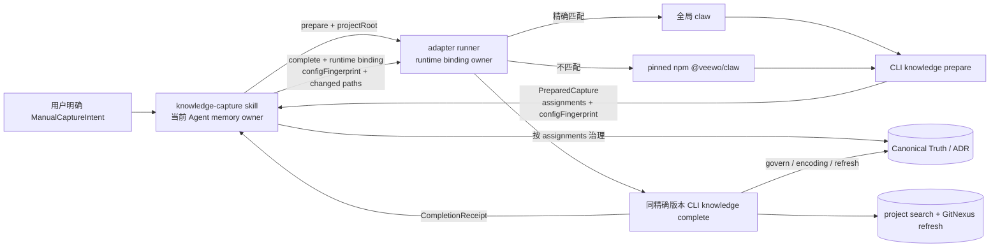
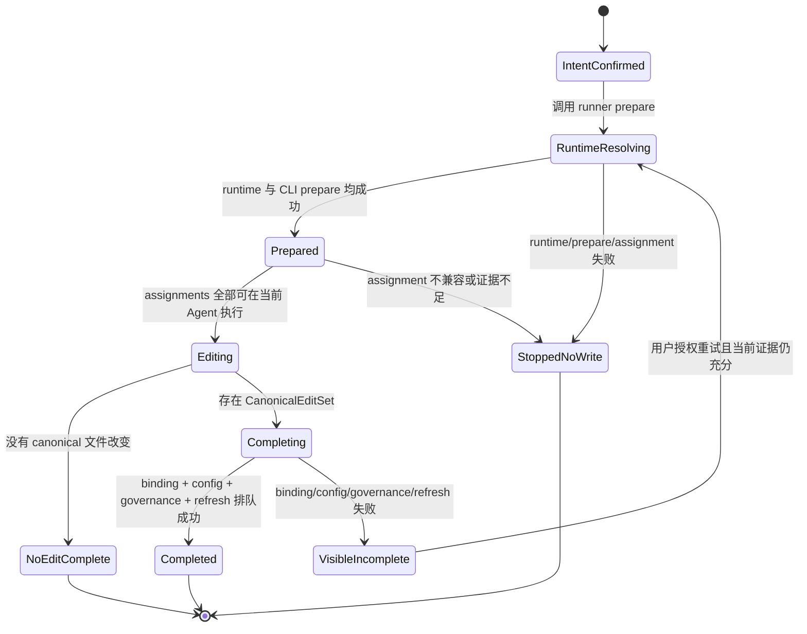

# 2026-08-21 17:30 独立知识沉淀兼容运行时

## 问题、范围与非目标

### 问题

Codex 的 `knowledge-capture` 是显式、同 Agent、非 claw workflow 的手动知识沉淀入口。它把 `claw knowledge prepare --source agent-memory` 作为所有写入之前的强制治理门禁，再由 `claw knowledge complete` 校验配置漂移、治理 canonical Markdown 并排队既有索引刷新。当前 skill 却直接解析 PATH 上的全局 `claw`。Codex 插件与 CLI 可以独立发布和安装，因此“skill 已经公开、全局 CLI 尚未包含该子命令”是可达状态。

本次现场证据正是这种状态：仓库及 npm 最新 CLI 为 `0.2.24`，全局 `@veewo/claw` 为 `0.2.22`；后者对 `knowledge prepare` 返回 `Unknown knowledge subcommand "prepare"`。仓库当前实现并不缺少该能力，失败发生在 skill 到 CLI 的运行时选择边界。

### 范围

- 让 Codex `knowledge-capture` 在全局 CLI 落后时仍能使用与当前插件合同匹配的、精确版本的已发布 CLI 完成 `prepare -> 治理 -> complete`。
- 保持同一 Agent、仅使用调用前已持有结论、Truth/ADR 写入前必须成功 prepare、配置漂移可见、失败不伪装成功等既有语义。
- 为插件内的知识沉淀调用增加可验证的运行时绑定、明确失败码和与发布版本同步的最小契约。
- 覆盖 Windows 与非 Windows 的命令解析，并把新 runner 纳入 Codex plugin bundle 与 focused tests。

### 非目标

- 不改变 `prepareDirectKnowledgeCapture`、`completeDirectKnowledgeCapture`、assignment、Truth/ADR 格式、治理、编码或 completion refresh 的领域语义。
- 不让 skill 直接读取 `.claw/project.json`、直接编辑 Truth 以绕过 prepare，或把 `claw context` 当作 prepare 替代品。
- 不自动升级全局 CLI 或 Codex plugin，不创建 plan、task、report、job、thread、background knowledge writer 或 collaboration subagent。
- 不把本次单消费者需求扩成通用 plugin runtime broker；出现第二个真实消费者前只服务 `knowledge-capture`。
- 不更改自动 knowledge finalization、内部 `delegate-writer` / `knowledge-writer` 或其他 Host adapter。

## 现状证据与参考资料

### 已接受的项目事实

- `.claw/truth/features/codex-manual-knowledge-capture.md:5-14` 规定同一 Agent 的 `prepare -> 治理 -> complete`，并声明手动入口与 plan、report、job、worker、thread、subagent 隔离。
- `.claw/truth/adr/codex-manual-knowledge-capture-boundary.md:7-20` 拥有“显式用户授权、同 Agent、无第二套 lifecycle owner”的决策；上下文不足或治理失败必须显式退出。
- `.claw/truth/adr/bounded-truth-and-adr-evolution-governance.md` 规定 writer 负责证据与 owner 判断，runtime 只对本次声明的 canonical Markdown 执行确定性治理、编码与刷新；不能用回退或默认值伪装成功。
- `.claw/truth/features/published-npm-packages.md` 说明 CLI/Core/Client 与 Codex marketplace adapter 是独立 artifact family；发布完成不等于本机安装同步，`update` 才把两者作为一个安装更新单元。

### 当前实现锚点

- `packages/codex-adapter/skills/knowledge-capture/SKILL.md:12-26` 正确限定了显式、同 Agent、无 workflow 写入，但第 20、25 行把两个阶段直接绑定到 PATH 上的 `claw`，没有兼容运行时解析。
- `packages/cli/src/cli.ts:1183-1202` 已公开 `knowledge prepare` 与 `knowledge complete`；`packages/cli/src/cli.ts:1412-1443` 由当前有效配置生成 assignments、资源路径与 `configFingerprint`；`packages/cli/src/cli.ts:1446-1485` 在 complete 重新 prepare、拒绝配置漂移、治理声明路径、归一化编码并排队刷新。
- `packages/cli/src/cli.ts:1494-1501` 拒绝 Truth 根目录外或非 Markdown 的 changed path；runner 不应复制这套规则或形成第二个路径 owner。
- `packages/core/src/knowledge-assignments.ts:126-159` 是同 Agent assignment 顺序和 built-in/external/doc-updater 投影的 owner；runner 只负责找到匹配 CLI，不重建 assignments。
- `packages/cli/test/cli-surface.test.ts:99` 已覆盖 prepare 只读与 stale fingerprint 拒绝，但没有覆盖“skill 已更新、全局 CLI 落后”的 adapter 组合。
- `scripts/codex-plugin-bundle.mjs:7-15` 已把整个 `skills` 与 `scripts` 目录纳入 plugin payload，适合携带一个小型 adapter runner 和版本声明，不需要改变 bundle 拓扑。
- `scripts/codex-plugin-bundle.test.mjs:143-151` 只断言 skill 文本含裸 `claw knowledge prepare/complete`，因此当前测试无法发现运行时错配。
- `packages/codex-adapter/skills/update/SKILL.md:26-27` 与 `TEMPLATE.json:48` 要求全局 CLI 和 plugin 一起更新并在新 task 验证。把完整 update 作为手动沉淀的前置条件会打断“当前 Agent memory 是唯一证据源”的核心合同。

### 已验证运行时与索引证据

- 2026-08-21 本工作区：`claw --version` 与 `npm list -g @veewo/claw --depth=0` 均显示 `0.2.22`；`npm view @veewo/claw version dist-tags.latest --json` 显示 `0.2.24`；`packages/cli/package.json:3` 也是 `0.2.24`。
- 同一全局 CLI 的 `claw context --host codex` 已识别项目版本高于 CLI，但其启动时发布快照仍可能返回 `updateAvailable: false` 与 `latestPublishedVersion: null`。因此 session-start 版本提示不能成为独立 skill 的实时能力门禁。
- GitNexus 索引状态为 stale（索引 commit `8384c5e`，当前 commit `340e678`），但仍定位到 `prepareDirectKnowledgeCapture` 与 `completeDirectKnowledgeCapture`；随后以当前源码 `rg` 和精读确认锚点。GitNexus 给出的直接调用关系是 `runKnowledge -> prepare/complete`，complete 再调用 prepare、governance、encoding 与 completion refresh；未发现另一个公开入口。
- `git log -S "prepareDirectKnowledgeCapture"` 将该能力引入定位到 `30148e9`（CLI `0.2.23` release）。这解释了为何 `0.2.22` 能识别 `knowledge` group 却不能识别 `prepare`。

以上结论均来自项目 Truth、当前源码、Git 历史、本机命令和 npm registry 的只读查询；本设计没有依赖未验证外部资料。

## 领域模型、术语、不变量与唯一 owner

### 术语

| 概念 | 含义 | 唯一 owner |
| --- | --- | --- |
| `ManualCaptureIntent` | 用户明确要求把当前 Agent 已建立的非 claw 结论写入 Truth/ADR | 当前 `knowledge-capture` skill 与发起它的 Agent |
| `CaptureRuntimeSpec` | 当前插件认可的 CLI npm 包名、精确版本、runner contract 版本 | `packages/codex-adapter/skills/knowledge-capture/runtime.json` |
| `CaptureRuntimeBinding` | 本次 prepare 实际采用的 runtime source、精确版本和 spec 指纹 | adapter runner；prepare 输出后由同一 Agent 原样传给 complete |
| `PreparedCapture` | CLI 返回的 truthDir、assignments、resource paths、顺序和 configFingerprint | `claw knowledge prepare` |
| `CanonicalEditSet` | prepare 成功后，本 Agent 实际修改的 truthDir 内 Markdown 绝对路径集合 | 当前 Agent 的内存；不落 report 或 sidecar 文件 |
| `CompletionReceipt` | complete 对配置、路径、治理、编码与 async refresh 的结果 | `claw knowledge complete` |

### 不变量

1. `ManualCaptureIntent` 必须来自用户明确请求；runtime fallback 不是自动触发知识沉淀的授权。
2. 在 `PreparedCapture` 成功返回、全部 assignments 可由当前 Agent 无委派执行之前，不得修改任何 canonical Truth/ADR。
3. runner 只选择和调用 CLI，不读取项目配置、不生成 assignment、不判断知识内容、不写 Truth，也不吞掉 CLI 错误。
4. prepare 与 complete 必须绑定同一个 `CaptureRuntimeSpec` 指纹；运行时声明在两阶段之间变化时，complete 必须在调用 CLI 前失败。
5. fallback 只允许精确的已发布 `@veewo/claw@<version>`，禁止 `latest`、未发布 workspace build、另一个 marketplace、模糊 semver range 或直接治理回退。
6. fallback 不安装或替换全局 CLI，不更新 plugin；它至多使用 npm 的临时执行缓存。用户安装状态不是该 skill 的第二份可编辑业务状态。
7. `configFingerprint` 继续只由 CLI 生成和校验；adapter 的 runtime binding 不能替代它。两者分别证明“执行合同未漂移”和“项目治理配置未漂移”。
8. complete 失败时，已发生的 canonical 编辑保持可见，skill 不回滚、不伪称完成，并按既有合同让用户决定是否在重新 prepare 后重试。
9. stdout 保持一个可解析 JSON envelope；所有 runtime 失败具有稳定 code、attempted source/version 和 cause，不能只暴露平台 shell 文本。

## 技术决策及每项决策的原因

### 决策 1：增加 knowledge-capture 专用 adapter runner

新增：

- `packages/codex-adapter/skills/knowledge-capture/scripts/run-knowledge-capture.mjs`
- `packages/codex-adapter/skills/knowledge-capture/runtime.json`

skill 先从自身 `SKILL.md` 解析 `<skill-dir>`，再通过 Node 调用 runner 的 `prepare` / `complete`，不再直接调用裸 `claw`。选择 adapter-local runner 是因为错配发生在插件 skill 与外部 CLI 之间；把解析规则放进 Core/CLI 无法帮助一个根本没有该子命令的旧 CLI。

runner 保持专用且薄：参数解析、runtime 选择、版本/能力验证、子进程调用、runtime binding 与结构化错误。它不复制任何 knowledge domain logic。

### 决策 2：精确版本优先，兼容全局时零下载，否则使用 pinned npm runtime

`runtime.json` 至少包含：

```json
{
  "schemaVersion": 1,
  "package": "@veewo/claw",
  "version": "0.2.24"
}
```

runner 的选择顺序：

1. 读取 spec，计算稳定 binding fingerprint。
2. 探测全局 `claw --version`，并确认 `claw help knowledge prepare` 与 `claw help knowledge complete` 成功。
3. 仅当全局版本精确等于 spec 且两个能力探测通过时使用全局 CLI。
4. 否则通过 `npm exec --yes --package @veewo/claw@<exact-version> -- claw ...` 使用 spec 声明的精确发布版本；调用知识命令前再次验证该 runtime 版本与能力。
5. pinned runtime 不可获得、版本不符或 capability 缺失时显式失败，不尝试旧 CLI、`latest` 或手工编辑。

全局版本高于 spec 时仍使用 pinned runtime。这样当前 loaded skill 与其 CLI schema 保持可重复组合，不假定未来 CLI 对旧 skill 永远向后兼容。全局版本恰好匹配时走快路径，不产生不必要的网络或 npm cache 活动。

### 决策 3：两阶段分别校验 runtime binding 与 config fingerprint

prepare 的 runner envelope 在原 CLI payload 外增加：

```json
{
  "captureRuntime": {
    "schemaVersion": 1,
    "package": "@veewo/claw",
    "version": "0.2.24",
    "source": "global | npm-exec",
    "binding": "sha256:..."
  }
}
```

skill 在内存中保存整个 `captureRuntime`。调用 complete 时额外传入 `--runtime-binding <fingerprint>`；runner 先对当前 `runtime.json` 重算并比较，再调用同一精确版本的 CLI。CLI 原有 `--config-fingerprint` 仍原样传递并由 `completeDirectKnowledgeCapture` 校验。

分离两个指纹的原因：runtime binding 是 adapter/CLI 合同一致性，configFingerprint 是项目治理配置一致性。把 runtime 字段塞进 CLI 的 configFingerprint 会让 Core 承担 adapter 安装拓扑，边界错误；完全不绑定 runtime 又允许两阶段在不同 CLI schema 上执行。

### 决策 4：版本声明进入现有发布同步门禁

扩展 `scripts/update-template-versions.mjs`（或提取其现有 release-version reader）以同时检查/更新 `runtime.json.version == package.json.version == packages/cli/package.json.version`。Codex adapter suffix（如 `0.2.24.1`）不用于推导 CLI 版本，避免把独立 artifact version 约定隐式写进 runner。

`scripts/codex-plugin-bundle.test.mjs` 负责证明 runner、runtime spec 和修改后的 skill 都进入 bundle；CLI release verification 已负责证明精确 npm 版本可发布获取。Codex adapter release 只能引用已经发布的 CLI 版本，这与现有“CLI release 在 plugin update 前完成”的顺序一致。

### 决策 5：不把完整 update workflow 当作捕获前置条件

完整 `claw-kit:update` 会修改全局 CLI 与 plugin，并要求 restart/new task 验证。手动沉淀的证据源却是当前 Agent 在 skill 启动前已有的结论；强制 restart 会使该证据边界不可持续。pinned runtime 只解决本次执行依赖，不声称安装已更新，也不削弱后续独立 update 的价值。

## 协作合同：入口、状态变化、事件或投影、失败与重试语义

### 上下文与数据流



`T` 是 canonical knowledge 的唯一事实源。runner、CLI output、Agent 内存和搜索索引都不是第二份可编辑 Truth。

### 状态机



### 命令入口

skill 对外仍叫 `knowledge-capture`；内部入口变为：

```text
node "<skill-dir>/scripts/run-knowledge-capture.mjs" prepare \
  --source agent-memory --project-root "<project-root>"

node "<skill-dir>/scripts/run-knowledge-capture.mjs" complete \
  --source agent-memory --project-root "<project-root>" \
  --runtime-binding "<binding>" \
  --config-fingerprint "<fingerprint>" \
  --changed-truth "<absolute-path>"
```

runner 移除 adapter-only 的 `--runtime-binding` 后，把其余参数原样交给 CLI。changed path 的次数、顺序和现有 skill 语义不在本次改变中重解释。

### 成功投影

- prepare：保留 CLI 的 `ok`, `command`, `schemaVersion`, `project`, `configFingerprint`, `assignments`, `refresh`，追加 `captureRuntime`。
- complete：保留 CLI 的 governance、truthEncoding 与 asyncRefresh 结果，追加同一个 `captureRuntime`。
- skill 最终仍只报告实际 canonical 变更、已运行 assignments、跳过声明和 completion 结果，不把 npm fallback 描述成安装升级。

### 失败码与失败不变性

| code | 条件 | 状态不变性 | 重试 |
| --- | --- | --- | --- |
| `KNOWLEDGE_CAPTURE_RUNTIME_SPEC_INVALID` | runtime.json 缺失、无效或版本未钉死 | prepare 前无 canonical 写入 | 修复/重装 plugin 后重新 prepare |
| `KNOWLEDGE_CAPTURE_RUNTIME_UNAVAILABLE` | 全局不匹配且 npm/pinned package 不可获得 | prepare 阶段无写入；complete 阶段保留现有编辑可见 | 网络或 npm 恢复后用原 binding 重试；若 spec 变化则重新 prepare |
| `KNOWLEDGE_CAPTURE_RUNTIME_MISMATCH` | 实际 runtime 版本或 capability 不符 | 不调用 knowledge 子命令 | 重新获取精确版本；不得降级到旧 CLI |
| `KNOWLEDGE_CAPTURE_RUNTIME_CHANGED` | complete 的 binding 与当前 spec 不同 | 不运行 CLI complete；已编辑 Truth 保持可见 | 重新 prepare 后由用户决定继续 |
| 既有 `KNOWLEDGE_DIRECT_*` | active workflow、resource 缺失、config drift、path 越界等 | 原 CLI 语义不变 | 按原错误处理，不由 runner 改写成成功 |
| 子进程非 JSON / 异常退出 | runtime 损坏或平台执行错误 | 不猜测结果、不继续下一阶段 | 返回结构化 cause，修复后重试 |

runner 对 CLI 已返回的结构化 error 保留原 code/message/details，只在 envelope 中附加 runtime 证据；这样调用者仍能按既有失败合同决策。

### Windows 与安全边界

- 使用 `spawnSync`/`execFile` 风格的参数数组；Windows 只在启动 `.cmd` 所必需的边界使用 `ComSpec /d /s /c`，projectRoot 与 changed path 不拼接进可执行脚本文本。
- npm 包名和版本只能来自已校验的 bundled `runtime.json`，用户输入不能改变 package spec。
- 不继承会把 CLI 指向 workspace build 的临时 release 环境变量；实际 runtime version 必须以子进程 `--version` 证明。
- stdout 只输出 JSON；平台诊断放入 error.details 或 stderr，不污染 CLI payload 的解析。

## 备选方案、取舍与重新评估条件

### 方案 A：要求用户先运行完整 `claw-kit:update`

收益是长期安装恢复一致，复用现有 update owner。未采用为当前执行路径：它会修改两个安装 surface 并要求 restart/new task，可能丢失同 Agent 的唯一证据上下文；而用户只是授权沉淀，不等同于授权安装更新。仍应在任务外建议用户维护安装，但不能把它作为本次 capture 成功的唯一通路。

### 方案 B：直接使用 `npm exec @veewo/claw@latest`

实现最少，但 `latest` 会让已加载的旧 skill 与未来 CLI schema 任意组合，prepare 与 complete 也可能跨 registry 更新点。拒绝。精确版本和 runtime binding 是可重复执行的最低成本。

### 方案 C：把完整 CLI/Core 打进 Codex plugin

可离线并彻底消除外部 CLI 错配，但会复制 CLI/Core 依赖、放大 marketplace payload、增加安全与发布验证面，并使 plugin 成为第二个 CLI 分发 owner。当前仅一个独立 skill 需要兼容 fallback，不成比例。

### 方案 D：skill 在 prepare 缺失时直接读取项目配置并编辑 Truth

表面上无额外 runtime，实质绕过 accepted ADR 的 assignment 投影、resource existence、config fingerprint、canonical path governance、encoding 与 refresh；会制造第二套不可验证 lifecycle。明确拒绝。

### 方案 E：只把裸错误改成“请升级”

能改善可诊断性，但不能满足“独立 skill 可以正确执行”的目标，也仍让当前 Agent memory 在等待升级/重启时失效。runner 的结构化失败已经包含这部分诊断，无需以停止为唯一功能。

### 重新评估条件

- 若第二个独立 plugin skill 也需要版本钉死的 CLI，则提取共享的 adapter runtime resolver；在此之前不泛化。
- 若 npm 不可用/离线导致的 fallback 失败成为常见场景，再评估随 plugin 打包一个最小 manual-capture runtime，而不是整个 CLI。
- 若 CLI 未来公开带 schema version 的稳定 capability handshake，并承诺跨版本向后兼容，可把“精确版本”放宽为经过测试的兼容范围。
- 若 Codex marketplace 获得安装依赖与原子激活机制，可把 CLI/plugin 一致性移回安装期；在那之前 runtime 仍需自证。

## 实施切片、迁移或兼容边界、验证证据

### 切片 1：可执行的 runtime binding（最小垂直切片）

1. 新增 `runtime.json` 与 `run-knowledge-capture.mjs`。
2. runner 实现 spec 校验、全局精确匹配快路径、pinned npm fallback、版本/capability 探测、单 JSON envelope 和上述四个 runtime 失败码。
3. prepare 输出 runtime binding；complete 强制接收并校验 binding，再透明转发 CLI 参数。

完成证据：用可控的 `claw`/`npm` shim 证明全局 `0.2.24` 走快路径且不调用 npm；全局 `0.2.22` 走 `@veewo/claw@0.2.24`；两条路径都得到 `knowledge.prepare`，且 fallback 不改变 `npm list -g @veewo/claw`。

### 切片 2：skill 接入且保持治理边界

1. 修改 `packages/codex-adapter/skills/knowledge-capture/SKILL.md`：解析 `<skill-dir>`，所有 prepare/complete 经 runner，保存并回传 runtime binding。
2. 保留“无 prepare 不写、assignment 不兼容则零写入、无 changed file 不 complete、complete 失败保留可见编辑”的原合同。
3. 不加入 update skill、plan 或 delegation 路由。

完成证据：bundle skill 文本测试锁定 runner 入口、binding 传递和禁止裸 CLI fallback；原有边界关键字继续存在。

### 切片 3：版本与 bundle 门禁

1. 将 runtime spec 纳入 `sync:template-versions` / `check:template-versions` 或相邻的 release-version check。
2. 扩展 `scripts/codex-plugin-bundle.test.mjs`，断言 bundle 含 runner/spec、spec CLI version 与 root/CLI package 对齐、skill 不再裸调用 PATH `claw knowledge prepare/complete`。
3. release smoke 从已打包 plugin 路径启动 runner，使用 published exact npm package 完成只读 prepare fixture。

完成证据：focused bundle test、version check 与 packaged prepare smoke 通过；不需要为文案或复制逻辑增加大范围 E2E。

### 切片 4：失败与重试回归

至少覆盖：

- 全局版本匹配但 capability 缺失：不信任版本字符串，转 fallback。
- pinned npm 不可获得：prepare 零写入并返回 `RUNTIME_UNAVAILABLE`。
- prepare 后 runtime.json/binding 改变：complete 不启动 CLI，canonical 编辑保持可见。
- CLI 返回 `KNOWLEDGE_DIRECT_CONFIG_CHANGED`、`KNOWLEDGE_DIRECT_PATH_INVALID`：runner 保留原 code 和非零退出。
- path 含空格、Unicode 和 Windows 盘符：参数不经字符串拼接变形。
- 多个 `--changed-truth` 的次数与顺序原样传递。

### 迁移与兼容边界

- CLI 的公开 `claw knowledge prepare/complete` 与 schema 不变，其他 Host 和直接 CLI 用户无迁移。
- 新 Codex plugin 自带 runner/spec；旧 plugin 保持旧行为，不尝试跨缓存目录修补。
- 全局 CLI 已精确匹配时没有行为差异，只多一次只读版本/capability 探测。
- 全局 CLI 过旧或过新时不会被修改；本次 capture 使用 pinned runtime，安装状态仍由独立 update workflow 拥有。
- runtime spec 只随正式 CLI release version 同步；Codex adapter suffix release 不改变它，除非其兼容 CLI 基线真的变化。

### 验收标准

1. 在全局 `claw 0.2.22`、plugin runtime spec `0.2.24` 的 fixture 中，knowledge-capture 能成功取得 `knowledge.prepare`，并证明实际使用 `@veewo/claw@0.2.24`。
2. prepare 与 complete 使用相同 runtime binding，CLI configFingerprint 仍能拒绝项目配置漂移。
3. fallback 不改变全局 CLI/plugin，不创建 claw workflow 产物，也不在 prepare 失败时改动 Truth。
4. runtime、assignment、governance、path、encoding或 refresh 的失败均保持可见；最终回复不能伪称沉淀成功。
5. 新 runner/spec 被官方 Codex plugin bundle 携带，版本门禁能阻止 spec 与 CLI package 漂移。

## 开放决策

无。现有证据足以选择“adapter 专用、精确版本、非安装式 fallback”；重新评估条件已明确，实施不需要先等待产品选择。
