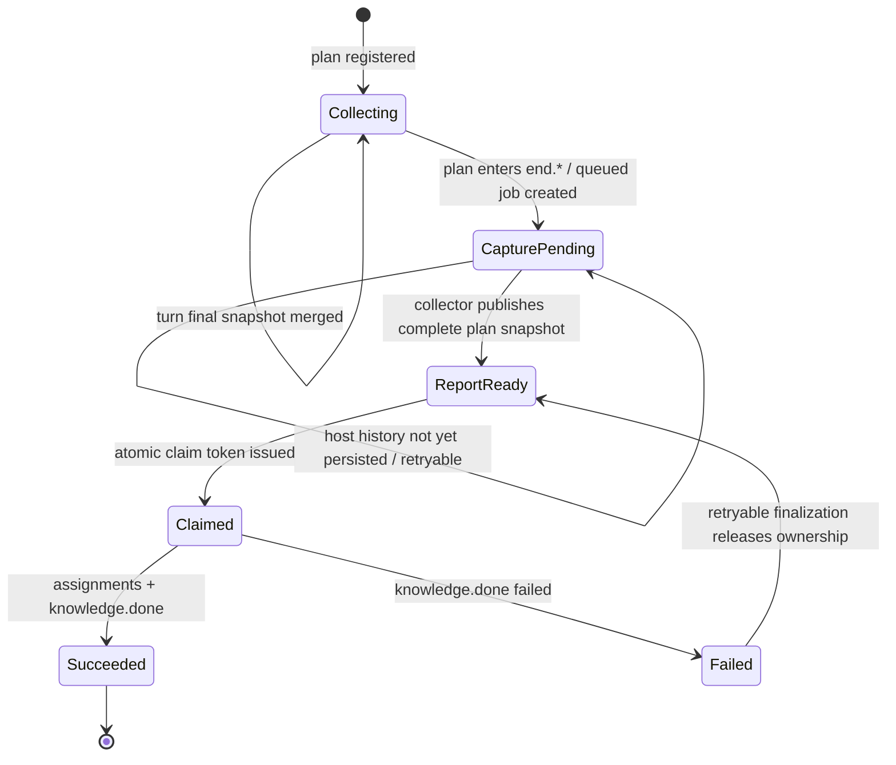
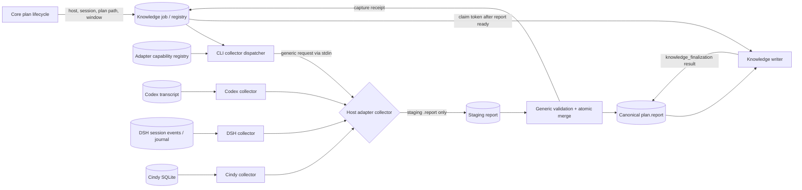

# 2026-08-22 13:19 — Host Adapter 自有 Report 收集接口重整

> 实现修订（2026-08-22）：report 的采集规则与产出形态只作为 adapter 需求规范，
> 不构成 CLI/Core 校验合同。collector 在 staging 路径写出任意自身产物；统一流程
> 仅检查 collector 成功产出文件并原样发布。本文下方关于 manifest、digest、固定
> event 字段与通用排序/去重的细节为已放弃的设计探索，不是当前实现要求。

## 结论摘要

可行，而且应当这样重整，但边界需要比“CLI 动态 import adapter”更严格：

- CLI/Core 继续拥有 plan、report canonical 路径、knowledge job、claim token、文件锁与发布状态；
- Codex、DSH、Cindy adapter 各自拥有原始 history/transcript 的发现、解析、turn-final 判定和采集完备性；
- CLI 只按 `host` 解析一个已注册的 collector capability，启动 adapter 自有 collector；
- collector 不把 host message DTO 回传给 CLI，而是在 CLI 指定的 staging 路径产出 adapter 自有的 `.report` 文件；
- CLI 只发布该文件，不再解释、校验、排序或要求其内容字段，也不再出现 Codex transcript、DSH capture、Cindy SQLite 的业务分支；
- 采集顺序与内容由 adapter 按 Host 的实际情况负责。

因此，report 文件是采集交付边界；collector 进程退出码只表达“已产出 / 尚未完备 / 失败”，不承载采集内容。

本设计状态为 `ready`，没有必须先由用户裁决的高影响开放问题。

## 问题、范围与非目标

### 问题

当前 CLI 同时承担通用 lifecycle 和三种 host 的历史格式解释：

- Codex claim 分支在 CLI 内发现 transcript、识别 `final_answer`、识别后续 `plan.create`；
- DSH claim 分支在 CLI 内知道 `dsh-capture` 用户目录、字段和 plan window 过滤；
- Cindy claim 分支在 CLI 内定义 `--cindy-report-stdin` 及其 `task_conclusions` payload；
- Core report writer还需要理解不同采集类型并处理排序。

每新增或调整一个 adapter，CLI 就要新增 host 分支、输入参数、格式类型和测试，导致“通用 CLI 发布”与“单一 Host 历史格式变化”被迫同步。

### 本轮范围

1. 设计 DSH、Codex、Cindy 三个 adapter 的统一重整方案。
2. 明确每个 adapter 的采集职责及共享的 collector/report 合同。
3. 保证一个 plan 拥有的所有 final 按实际时间先后进入 report。
4. 定义 ready-job、report collection、claim 的协作、失败和重试语义。
5. 给出一次性迁移路径；不保留旧 collector 或 CLI host-parser 的运行时兼容层。

### 非目标

- 本文不修改任何运行时代码、测试、Truth 或 ADR。
- 不改变 `.claw` plan/task/subplan 的 canonical lifecycle。
- 不改变 writer assignment、Truth→ADR、claim token 或 `knowledge.done` 合同。
- 不把 Host UI、adapter cache 或 transcript 变成第二份 plan 状态。
- 不在本轮迁移 OpenCode；通用合同应允许以后接入，但不把它算作本设计的验收范围。
- 不要求三种 Host 使用相同原始历史格式、相同 SDK 或相同生命周期 hook。
- 不把本次重整扩大成通用插件框架；只抽取已有三种 collector 的真实共同边界。

### 工作区保护边界

调查开始时 `main` 相对 `origin/main` ahead 1，且以下文件已有未提交修改：

- `packages/cli/src/cli.ts`
- `packages/cli/src/codex-transcript.ts`
- `packages/cli/test/cli-closeout.test.ts`
- `packages/core/src/knowledge-sidecar.ts`

本文把它们作为“当前工作区事实”只读研究，没有覆盖或修改。尤其 `final_answer`、`occurredAt` 和按时间排序的代码属于未提交实现，不能误称为已发布合同。

## 现状证据与参考资料

### 项目知识与既有决策

- `.claw/truth/adr/hook-owned-two-phase-knowledge-finalization.md` 已确定目标语义：一个 Codex report conversational record 对应一个真实 agent turn 的最终 assistant message；`task.done` 不是 turn，final 不能因通常重复而全局丢弃。
- `.claw/truth/features/codex-knowledge-capture-boundary.md` 记录当前实现边界：Core 拥有 job/claim/done，Codex subagent 目前在 claim 时扫描父 transcript，background 则由 Stop 捕获。
- `.claw/truth/adr/dsh-adapter-native-subagent-knowledge-route.md` 与 `.claw/truth/features/dsh-knowledge-dispatch-and-finalization.md` 记录 DSH 当前通过 adapter 写 `dsh-capture`、CLI claim 读取的路线，也记录 DSH 存在 `agent/turn-stopping` 能力的设计基线。
- `docs/platform-adapter-porting-guide.md:81-105` 已把 transcript bridge 放在 Host adapter 层，而 Core 是 plan 状态与持久化语义 owner；`docs/platform-adapter-porting-guide.md:150-152` 把 turn report 与 knowledge job 分成相邻但不同的能力。
- `packages/cindy-adapter/references/cindy-adapter-design.md:173-188` 明确 Cindy adapter 读取本地 SQLite 并物化相邻 report，且 capture 失败应可见、可重试。

这些资料共同支持“Host history interpretation 属于 adapter；job lifecycle 属于 Core”，而不是继续在 CLI 中扩充 Host parser。

### 当前代码关系

| 事实 | 精确锚点 | 影响 |
| --- | --- | --- |
| CLI 已有固定 Host 列表和能力谓词 | `packages/cli/src/invocation-host.ts:3-27` | host identity 可以继续属于 CLI，但不应等于 history parser 所有权 |
| Cindy stdin schema 与解析函数位于 CLI | `packages/cli/src/cli.ts:1148-1184` | CLI 直接知道 Cindy payload 字段 |
| `knowledge claim` 按 `cindy`、`dsh`、`codex` 三分 | `packages/cli/src/cli.ts:1267-1424` | 新 adapter/格式变化必须改 CLI |
| DSH null-host 兼容依赖 capture 文件存在性猜测 host | `packages/cli/src/cli.ts:1361-1394` | 文件格式已渗入 host routing |
| Codex transcript discovery/extraction 在 CLI package | `packages/cli/src/codex-transcript.ts:1-144`；当前未提交的 plan-final extractor 在 `:146-206` | CLI 随 Codex transcript 演进 |
| DSH capture 用户目录及 JSON schema 在 CLI | `packages/cli/src/dsh-capture.ts:5-58` | CLI 与 DSH adapter 的私有 cache 双端耦合 |
| Core registry/job 已拥有 report target 与 capture 状态 | `packages/core/src/knowledge-sidecar.ts:15-68`、`:243-385` | 不需要 adapter 另建 lifecycle 数据库 |
| Core Stop capture 同时写 task conclusion 与 final | `packages/core/src/knowledge-sidecar.ts:404-525` | 当前 conversational contract 尚未统一到 all-final |
| DSH adapter 已能读取完整 session events | `packages/dsh-adapter/src/index.ts:397-412` | 原始历史解析可以完全留在 DSH adapter |
| DSH adapter 当前写中间 capture 文件 | `packages/dsh-adapter/src/index.ts:192-211` | 可迁移为 adapter collector 的私有输入，不再由 CLI 读取 |
| Cindy adapter 已拥有 SQLite reader 和 turn retry | `packages/cindy-adapter/plugin/node/cindy-sqlite-reader.cjs:380-448` | CLI 无需知道 Cindy DB 格式 |
| Cindy claim-time scan 已知道 plan window 与后续 plan-create 边界 | `packages/cindy-adapter/plugin/node/cindy-sqlite-reader.cjs:451-504` | plan-final snapshot 可在 adapter 内完成 |
| Cindy 当前把 host payload经 stdin交给 CLI | `packages/cindy-adapter/plugin/node/claw-worker.cjs:1181-1206` | 应由 report-file handoff 替代 |
| Codex Stop 的 adapter script 已是 CLI 前置入口 | `packages/codex-adapter/scripts/knowledge-finalizer.mjs:1-27` | 可负责注册/触发 Codex collector，而无需 CLI内嵌 parser |
| Canonical report 已有 containment 与 file lock | `packages/core/src/knowledge-sidecar.ts:781-813`、`:846-895`；`packages/core/src/io.ts:57-84` | CLI/Core 应继续拥有安全发布与并发写入 |

### GitNexus 与精确搜索边界

项目配置 `.claw/project.json` 开启 `gitnexus: true`。本轮执行 `gitnexus status` 显示索引 commit 为 `3425850`，当前 commit 为 `9b4e15a`，状态 stale；两次关系查询只粗略命中 `readCindyKnowledgeClaimCaptureInput`、DSH/Cindy入口等候选，不能证明完整调用链。随后使用 `rg` 和逐段源码精读确认了上述锚点。索引元数据见 `.gitnexus/meta.json`。

### 当前实现中的方向性工作

未提交工作区已经尝试：

- 将 Codex claim 从 `task.done` conclusions 改成 plan window 内全部 `final_answer`；
- 给 conversational entry 增加 `occurredAt`；
- 写 report 时按 event time 稳定排序。

这些方向符合本设计的内容合同，但实现仍把 Codex parser 放在 CLI，只解决了“收什么、怎么排序”，没有解决“谁解释 Host history”。本设计应作为其边界重整依据，而不是覆盖这些改动。

## 领域模型、术语、不变量与唯一 owner

### 术语

| 术语 | 定义 |
| --- | --- |
| Host History | Codex transcript、DSH session events、Cindy SQLite messages 等 Host 原生事实源 |
| Final Event | Host 已确认的一个真实 turn 的最终 assistant response；commentary、tool call/result、`task.done` checkpoint 均不是 final |
| Plan Capture Window | 某 plan 对 final event 的独占拥有区间，从 Core 登记 `activeStartedAt` 开始，到 plan owner 关闭并完成终态 turn flush 或遇到后继 plan-create 边界为止 |
| Collector | adapter 自有的可执行采集入口；解释 Host History，生成通用 staging report |
| Staging Report | collector 的唯一内容输出；由 CLI 指定路径、由 adapter完整写出、尚未成为 canonical source |
| Canonical Report | 与 `plan.json` 相邻的 `plan.report`；writer 的可信采集材料之一 |
| Capture Receipt | CLI 对 staging report 完成通用校验与发布后的 job/registry 元数据，不包含 Host message DTO |
| Evidence Seal | 对一次 plan snapshot 的 event count、顺序与 digest 的通用证明；使空 capture 与“未采到”可区分 |

### 唯一 owner

| 事实/职责 | 唯一 owner | 其他层允许做什么 |
| --- | --- | --- |
| plan lifecycle、active/pending plan、report canonical path | Core | adapter 只消费不可编辑 request |
| Host History 的定位、权限和格式 | 对应 adapter | CLI 不读取 raw history |
| 哪条 Host message 是真实 turn final | 对应 adapter | CLI 只校验通用 event schema |
| plan capture window 的 canonical 起点和终态 mutation | Core | adapter 将其映射到 Host turn/boundary |
| staging report 内容与 capture completeness | 对应 collector | CLI 不补造、猜测或默认空成功 |
| canonical report containment、merge、锁、原子发布 | Core/CLI | adapter 不直接改 job/registry |
| capture status、claim ownership、done/fail | Core | adapter 不签发 token |
| Truth/ADR writer 与 `knowledge_finalization` result | finalizer/Core | collector 不写 Truth/ADR |
| collector 安装位置和版本 | adapter capability registry | job只引用 host与contract，不固化旧私有格式 |

### 不变量

1. CLI 内不得出现 Codex transcript record、DSH event/cache、Cindy SQLite row 的字段判断。
2. Adapter 不得写 plan、knowledge job、claim token、Truth 或 ADR。
3. Collector 的成功必须由一个可验证 staging report 表示；stdout 不传采集内容。
4. `eventCount = 0` 只有在 collector 明确证明 capture window 已关闭且确实无 final 时才是合法成功；“history 不可用”不是空成功。
5. 同一 plan 的 conversational events 按 `(occurredAt, hostSequence, eventId)` 稳定排序；没有任何 `entryType` 排序权重。
6. `hostSequence` 是 Host 原始记录中的单调顺序或 adapter 扫描序号；同 timestamp 时它保持真实因果顺序。
7. 同一个 Host final event 由稳定 `eventId` 幂等去重，重试不得重复追加。
8. conversational evidence 在 claim 成功时冻结；claim 后 collector 不再补写该 capture generation。
9. `knowledge_finalization` result 可以在 writer 完成后追加，但不改变已冻结 final event 的顺序或 digest。
10. 任何 capture/collector 失败都不能回滚已成功的 plan mutation；它只能让 report remain pending、job保持可重试。
11. subplan 结束并恢复 parent 时，终态 turn final 只归 pending ended subplan；parent 从下一个 Host turn 开始恢复采集，禁止双写。
12. 一个 turn 内成功创建后继 plan 时，以成功 `plan.create` 为 owner 切换边界；其后的 final 属于新 plan，不倒灌旧 plan。

## 技术决策及每项决策的原因

### 决策 1：Collector 是 adapter 自有可执行能力，不是 CLI 内部 TypeScript 分支

新增版本化 `ReportCollector` process contract。CLI 根据 job/registry 的 `host` 查找 adapter capability descriptor，以 `spawn` + argv 启动 collector；不动态 import adapter package，也不静态依赖 adapter。

原因：

- 三个 adapter 的分发形态不同：Codex marketplace plugin、DSH npm/Cordis plugin、Cindy 独立 marketplace；静态 package dependency 会重新把发布节奏绑回 CLI。
- process boundary 对 ESM/CJS、Node package layout 和 Host SDK隔离更稳。
- adapter 可独立更新 Host parser，只要继续产出同一 report contract。
- CLI 的 host routing 只保留 `host -> capability`，不保留任何 history 业务。

### 决策 2：使用 adapter capability registry 解决 collector 定位

每个 adapter 在自己的 startup/session-start 路径幂等登记 collector descriptor；CLI 从用户级 claw runtime registry 解析当前兼容 collector。

建议 descriptor：

```json
{
  "schemaVersion": 1,
  "host": "codex",
  "capability": "report-collector",
  "contractVersion": 1,
  "adapterVersion": "0.2.x",
  "executable": "C:\\Program Files\\nodejs\\node.exe",
  "args": ["C:\\...\\claw-kit\\scripts\\report-collector.mjs"],
  "adapterRoot": "C:\\...\\claw-kit"
}
```

安全规则：

- descriptor 只能由显式 `claw adapter register` 内部入口写入；
- host、contract version、absolute executable/script、adapter root 都必须校验；
- spawn 不经过 shell，不拼接用户字符串；
- job不永久冻结某个版本缓存路径，而是在执行时解析当前兼容 registration；
- registration 缺失或路径失效时产生可观察 retryable failure，不回退到 CLI 内嵌 parser。

原因：Codex plugin cache、Cindy marketplace、DSH npm 的物理路径都可能升级变化，约定固定 PATH command 或让 CLI扫描各 Host 安装目录都不稳定。

### 决策 3：Collector 输出 staging report；CLI 只做通用验证和 canonical publish

CLI 通过 stdin 给 collector 一个无 Host history 字段的请求：

```ts
type ReportCollectionRequestV1 = {
  schemaVersion: 1;
  contractVersion: 1;
  captureId: string;
  host: "codex" | "dsh" | "cindy";
  projectRoot: string;
  planPath: string;
  canonicalReportPath: string;
  stagingReportPath: string;
  sessionId: string;
  window: {
    startedAt?: string;
    terminalMutationAt?: string;
    finalizeId?: string;
    boundary: "through-current-turn" | "through-plan-terminal-turn";
    expectedTurnId?: string;
  };
  deadlineAt: string;
};
```

其中 `expectedTurnId` 是 Host hook 已提供时的通用 boundary identity；CLI 不解释其格式。collector 必须只写 `stagingReportPath`，不得直接写 canonical report、job 或 registry。

CLI完成以下通用发布步骤：

1. 确认 staging path 与 canonical path 均在目标 task directory 内，拒绝 symlink/path escape；
2. 读取 capture manifest，校验 host/session/captureId/contract、eventCount 和 digest；
3. 校验每条 event 的通用字段、稳定 identity 和顺序；
4. 在 canonical report lock 下按 `eventId` merge；
5. 按实际 event 顺序稳定重排所有 conversational entries，不按 type 分组；
6. 原子替换 canonical report；
7. 把 evidence digest、event count、collector version 和 capture time写入 Core job/registry；
8. 成功后删除 staging 文件；失败时保留受控诊断元数据，不能发布半文件。

原因：adapter 产出的是 report 文件，CLI 不需要再对接 Host DTO；同时 canonical containment、并发锁和跨 collector merge 仍保持唯一实现。

### 决策 4：Report 只采真实 final，新代码不再制造 `task_conclusion`

统一的新 conversational entry：

```json
{
  "schemaVersion": 1,
  "entryType": "final_answer",
  "host": "codex",
  "sessionId": "...",
  "turnId": "...",
  "eventId": "sha256(host + session + native-final-identity)",
  "occurredAt": "2026-08-22T04:55:01.123Z",
  "hostSequence": 1842,
  "capturedAt": "2026-08-22T04:55:02.000Z",
  "message": "..."
}
```

规则：

- `occurredAt` 使用 Host 原始时间；Host没有可靠 wall-clock 时允许缺省，但必须提供单调 `hostSequence`；
- `turnId` 是 Host turn identity，不由 CLI生成；
- `eventId` 对重扫和重试稳定；
- collector 扫描 plan window 内每个已完成 turn，只保留该 turn 的最终 assistant response；
- commentary、intermediate assistant message、tool call/result、task checkpoint 不进入新 report；
- legacy `task_conclusion` 继续可读、可保留，但新 collector 不再新增。

原因：已接受 ADR 已把真实 turn final 定为目标语义；三个 Host 不应分别保留不同的 checkpoint 近似物。

### 决策 5：排序以 Host 因果顺序为准，不以采集方式为准

对 conversational entries 使用以下比较：

1. 双方都有有效 `occurredAt`：时间早者在前；
2. timestamp 相同或任一缺失且属于同一 Host session：较小 `hostSequence` 在前；
3. 仍相同：稳定 `eventId`；
4. legacy entry 缺少时间和 sequence 时保留其既有相对位置，不伪造时间。

一次 full-plan collector snapshot、早先 Stop append、claim-time补扫的条目会被放回同一真实时间轴；不得先写 `task_conclusion` 再写 `final_answer`，也不得按 collector batch 分组。

`knowledge_finalization` 是 lifecycle result，不是 conversational final；它按 `recordedAt` 留在实际发生位置，并且不参与 final 去重。

### 决策 6：subagent job 仍可先创建，但 claim 必须等待完整 report snapshot

终态 plan mutation仍可先创建 queued job并返回 `knowledgeDispatch`，以保留前台不等待 writer 的要求；但 `queued` 不再等于 report-ready。

新状态关系：



`knowledge claim` 的 prepare 阶段统一做：

1. 如果 evidence seal 尚不存在，运行当前 host 注册的 collector；
2. collector 可在 `deadlineAt` 前等待 Host 持久化 terminal final；
3. output 未完备则返回稳定 retryable error，job仍 queued且不发 token；
4. output 完备并发布后，Core在同一 job lock 内记录 receipt并签发 claim token。

这样 Codex/DSH/Cindy 的“历史何时可见”仍由 adapter判断，而 CLI claim不再分 host。已经启动的 subagent可以在后台有限重试；Lead 不等待它。

### 决策 7：空 capture 必须由 manifest 证明

Staging report 第一条是 collector manifest，不进入 canonical conversational content：

```json
{
  "schemaVersion": 1,
  "recordType": "capture_manifest",
  "contractVersion": 1,
  "captureId": "...",
  "host": "dsh",
  "sessionId": "...",
  "complete": true,
  "eventCount": 0,
  "eventsSha256": "e3b0c442...",
  "collectorVersion": "0.2.x",
  "completedAt": "2026-08-22T05:00:00.000Z"
}
```

`complete: true, eventCount: 0` 表示 collector已观察到关闭边界且窗口内确无 final；history missing、DB locked、transcript尚未flush、session不匹配都必须是 pending或failed，不能写空成功。

## 三个 adapter 的统一职责与专属职责

| Adapter | 原始事实源 | Final 判定 | 完整性/边界 | 迁移后移出的 CLI 逻辑 |
| --- | --- | --- | --- | --- |
| Codex | `%CODEX_HOME%/sessions/**/rollout-*.jsonl` 或 Host 后续提供的等价公开 transcript | `response_item` 中 `role=assistant && phase=final_answer`；turn id 与 timestamp 来自 Host record | 从 `activeStartedAt` 扫描；遇到匹配的后继成功 `plan.create` 停止；terminal capture 等待 terminal mutation 后的 final 或已证明的后继 owner boundary | `findCodexTranscriptPath`、`extractLatestFinalAssistantMessage`、`extractTaskDoneConclusions`、`extractPlanFinalAssistantMessages` |
| DSH | adapter 可访问的 `sessionQuery` events；必要时写 adapter 私有 journal | 每个已完成 DSH turn 的最后一条 `assistant/message`，以 `agent/turn-stopping`/session event 证明 turn 完成 | adapter 在 turn-stopping 时持久化 final journal；collector按 plan window重扫并证明 terminal turn；终态 mutation snapshot只能作为触发，不能把尚未发生的 final 伪装完成 | `packages/cli/src/dsh-capture.ts`、claim 中 `dsh`/null-host分支、CLI 对 `time` 字段的过滤 |
| Cindy | Cindy 本地 SQLite message rows | 每个由用户/Host turn boundary分段的最后一个 assistant row；`created_at` 与 row/client identity形成顺序 | `did-turn-end` 触发 through-current-turn；claim时full-plan重扫；后继成功 plan-create row关闭旧窗口 | `readCindyKnowledgeClaimCaptureInput`、`--cindy-report-stdin`、CLI 对 `task_conclusions` 的了解 |

### Codex 迁移细节

- 在 `packages/codex-adapter/scripts/` 增加 collector；Codex transcript 解析测试也迁到 adapter。
- `SessionStart` adapter script 幂等注册 collector，然后继续现有 `claw context --host codex`。
- Stop script 仍是 fail-open lifecycle trigger，但调用通用 report collect/claim路径，不再让 CLI解析 `transcript_path`。
- hook payload 的 transcript path可以作为 adapter-private hint写入 collector自己的临时 context；CLI request不增加 Codex字段。
- subagent claim 的 collector需要重扫全 plan window，以补齐任何漏掉的 Stop final，并等待 terminal final flush；不再固定睡眠后直接由 CLI扫 transcript。

### DSH 迁移细节

- `packages/dsh-adapter/src/capture.ts` 演进为 final-event collector，不再提取 `task.done` 前置文本。
- 恢复/采用 `agent/turn-stopping` 作为 final boundary；adapter把最小 final event journal 写到自己的 user runtime目录，或直接让 collector访问 adapter session snapshot。
- 当前 terminal `claw_run` 内的 session snapshot仍可触发一次采集，但它不能证明尚未生成的本 turn final；完整性必须等 turn-stopping 或后继 owner boundary。
- DSH collector只读取新的 adapter-private final journal；CLI 删除 host-null 文件存在性推断，不保留旧文件 fallback。
- `claw_run` 自动 dispatch、native subagent与 hostActions 不受影响。

### Cindy 迁移细节

- SQLite discovery、row schema、tool use/result识别全部留在 Cindy adapter。
- 新 collector按真实 turn分段收集 final，而不是只提取 successful task completion conclusions。
- `did-turn-end` worker 调通用 collector入口；`knowledge.claim` 不再构造stdin capture JSON。
- Cindy 独立 marketplace artifact 与 CLI 在同一切换发布中升级为 collector contract；不保留旧 stdin 路径。
- Orca worker、assignment subplan与 `knowledge.done` 不变。

## 协作合同：入口、状态变化、事件或投影、失败与重试语义

### 上下文与数据流



依赖方向是 CLI/Core → stable collector process contract；不存在 CLI → Host history schema 依赖，也不存在 adapter → Core internal types 的编辑权限。

### 入口合同

1. `adapter register`：adapter startup幂等登记 `report-collector` capability。
2. `report collect current-turn`：Host turn hook触发，CLI构造通用 current-turn request并发布增量/full snapshot。
3. `knowledge claim`：若 job capture未ready，CLI先运行 full-plan collector；成功发布后再原子 claim。
4. `knowledge done/fail`：保持现有 token-protected合同。

所有入口只接受 Core 已解析出的 canonical plan/report target；模型、adapter或hook不得自行指定 task外路径。

### 成功结果

- collector exit 0；
- staging report存在且 manifest `complete=true`；
- manifest、event schema、eventCount、digest与排序校验通过；
- canonical report原子发布；
- capture receipt写入 job/registry；
- claim场景才继续签发 token。

collector stdout可为空；CLI不从 stdout 读取 messages。

### 失败分类

| 错误 | 语义 | 状态不变性 | 重试 |
| --- | --- | --- | --- |
| `REPORT_COLLECTOR_UNREGISTERED` | 当前 host没有兼容 collector | plan不回滚；job queued/capture pending | adapter下次startup注册后重试 |
| `REPORT_COLLECTOR_INCOMPATIBLE` | contract version不相交 | 不运行未知 collector | 更新 adapter或CLI后重试 |
| `REPORT_HISTORY_PENDING` | Host尚未持久化预期turn/boundary | 不发布staging；不签发token | bounded backoff，deadline后保持queued |
| `REPORT_HISTORY_UNAVAILABLE` | transcript/DB/session不匹配或权限失败 | 不把空文件当成功 | 修复来源后重试 |
| `REPORT_COLLECTOR_TIMEOUT` | collector超过deadline | 终止子进程；canonical不变 | 下次claim/hook重试 |
| `REPORT_CONTRACT_INVALID` | manifest、digest、entry不合法 | staging隔离；canonical不变 | adapter bug，升级后重试 |
| `REPORT_WRITE_CONFLICT` | canonical lock冲突 | 两份写入都不伪造成功 | 短退避重试 |
| `REPORT_CAPTURE_ALREADY_SEALED` | claim后收到晚到写入 | frozen evidence不变 | 只接受完全重复event；新增event需新generation并显式处理 |

### 重试与幂等

- hook 允许 fail-open退出，但写一条脱敏 diagnostic；不得包含用户message、完整path或transcript内容。
- collector以同一 `captureId` 重跑必须产生相同或只增加晚到、仍属于窗口的 events；发布后以 `eventId` 去重。
- claim token只在完整 snapshot发布后签发；capture失败不增加 writer attempt。
- writer失败增加 finalization attempt，但不重新解释 Host history；它复用已冻结 evidence digest。
- 只有 capture尚未seal时允许补扫；seal后普通 turn hook只能 no-op/duplicate。

## Report 文件合同

### Staging report

- UTF-8、JSONL、无BOM；第一行必须是 `capture_manifest`。
- 后续只能是 `final_answer` events，严格按 collector观察的Host顺序。
- manifest中的 `eventsSha256` 对后续规范化JSONL bytes计算。
- staging文件可安全为空事件，但不能没有manifest。
- collector用同目录临时文件 + rename完成 staging写入，CLI绝不读取半文件。

### Canonical report

- 路径继续由 `deriveKnowledgeReportPath(planPath)` 得到，与 plan相邻。
- 保持现有 schemaVersion 1 的加法兼容，新增 `host`、`eventId`、`occurredAt`、`hostSequence`。
- 新 conversational write仅使用 `entryType: "final_answer"`。
- legacy没有 `entryType` 的 turn-final以及 `task_conclusion` 保留，不在迁移时丢弃或伪造时间。
- `knowledge_finalization` 继续由Core写入，同 `finalizeId` 幂等。
- capture manifest不复制进canonical；其digest/count进入job `reportCapture` receipt。

建议扩展 receipt：

```ts
reportCapture: {
  mode: "claim" | "turn";
  status: "pending" | "captured";
  contractVersion: 1;
  collectorVersion?: string;
  startedAt?: string;
  capturedAt?: string;
  eventCount?: number;
  evidenceSha256?: string;
  lastEventId?: string;
}
```

不得继续把 `transcriptPath` 写入通用 job；这是 Codex adapter私有诊断，不是Core合同。

## 备选方案、取舍与重新评估条件

### 采用方案：注册的 adapter collector + report-file handoff

收益：

- CLI与Host history格式完全解耦；
- adapter可独立升级parser；
- report是可审计、可重放的稳定交付物；
- Core仍统一保证路径、锁、job和claim原子性；
- 三个Host共享同一验收合同，但保留各自能力差异。

代价：

- 新增capability registration与process contract；
- subagent claim需要处理Host持久化延迟；
- 三个artifact需要协调一次兼容迁移。

### 备选 A：CLI 静态 import 三个 adapter package

拒绝。CLI仍需随adapter发布，Codex/Cindy/DSH的module layout和安装位置不同，还会让通用CLI携带不需要的Host依赖。只有未来三个adapter真正合并为同一发布单元时才重新评估。

### 备选 B：Adapter 输出 normalized JSON 到 CLI stdin/stdout

拒绝作为内容边界。它虽然比raw history好，但CLI仍需处理payload大小、partial stream、Cindy专属flag和host DTO演进。report文件已经是writer需要的最终材料，没有必要再造一层消息传输。进程状态可用exit code表达，内容只走文件。

### 备选 C：Adapter 直接写 canonical `plan.report`

不采用。它会把Core lock、path containment、legacy merge、knowledge-finalization并发和排序实现复制进三个adapter。只有未来canonical report完全移出Core时才重新评估。

### 备选 D：继续在 CLI 中维护 host switch，只把parser拆成文件

拒绝。它改善文件组织但不改善ownership和发布耦合；当前 `codex-transcript.ts` / `dsh-capture.ts` 已证明“单独文件”仍是CLI业务。

### 备选 E：完全依赖每轮hook增量append，不在claim full-plan重扫

拒绝。hook会缺失、延迟或重复，真实项目已有nested cwd/Stop覆盖事故记录。full-plan重扫是closeout completeness的安全网；incremental capture只优化及时性，不是唯一真相。

## 实施切片、迁移或兼容边界、验证证据

### 切片 1：建立通用合同与一次性迁移器

- 在Core/CLI定义 request、manifest、final event、receipt、错误码和generic merge。
- 增加capability registry和无shell collector launcher。
- 用fixture collector验证0条、1条、多条、乱序、重复、invalid digest、timeout、path escape。
- 为 existing canonical report、queued job 和 registry 写一次性迁移器：补齐新 receipt 所需字段，保留已存在的 canonical evidence；无法证明的旧 queued capture 显式标为需要重新采集，不伪造成功。
- 此切片只建立迁移工具与合同测试；切换提交不得同时保留旧 parser 的运行时 fallback。

完成证据：CLI contract tests可在不知道任何Codex/DSH/Cindy字段的情况下发布report。

### 切片 2：Codex 竖切与shadow compare

- 把 transcript discovery与final extraction复制/迁移到Codex adapter collector。
- SessionStart注册collector；Stop/claim走generic dispatcher的shadow mode。
- 同一fixture同时运行旧parser与collector，比较final event identity、顺序和window cutoff；只记录差异，不双写canonical。
- 真实Codex验证一个plan跨多个用户turn、同turn commentary/tools、多个final、terminal final与后继plan-create。

切换条件：collector snapshot与人工审阅transcript一致，且所有final按timestamp/sequence排序。

### 切片 3：DSH collector与turn boundary

- adapter订阅/验证`agent/turn-stopping`，写adapter-private final journal；终态mutation保留一次full snapshot触发。
- collector只读session events/journal，产出all-final staging report。
- 直接切换到 adapter-private final journal；既有 queued job 需要在新 adapter session 中重新触发采集，collector 与 CLI 均不读取旧文件。
- 真实DSH验证auto-dispatch subagent早于Lead final启动时，claim等待collector看见terminal final后才成功。

切换条件：真实Host证明turn-stopping/event持久化顺序；如果Host版本不提供可靠turn boundary，则该版本明确报告`REPORT_HISTORY_PENDING/UNAVAILABLE`，不能退化为把任意assistant message当final。

### 切片 4：Cindy collector与独立artifact交付

- Cindy SQLite reader改为按turn选择final，保留created_at/row sequence。
- did-turn-end与Orca claim均改用generic collector；移除stdin capture内容传输。
- 在独立Cindy marketplace repo先发布兼容adapter，再提升CLI最低capability要求。
- 真实Cindy验证SQLite写入延迟、DB lock、session alias、空窗口、后继plan-create。

切换条件：安装artifact版本、CLI版本、collector registration和真实SQLite snapshot全部有证据。

### 切片 5：原子切换并删除 Host 业务耦合

删除或迁出：

- `packages/cli/src/codex-transcript.ts`；
- `packages/cli/src/dsh-capture.ts`；
- `readCindyKnowledgeClaimCaptureInput`；
- `--cindy-report-stdin`；
- `knowledge claim` 内 `cindy/dsh/codex/null-host` capture分支；
- Core/CLI新增 `task_conclusion` 的生产路径；
- generic job中的 `transcriptPath`。

保留：

- `SUPPORTED_CLAW_HOSTS` 与host能力矩阵；
- hostActions、writer launcher选择、adapter-specific UI/Goal；
- canonical report、job、claim/done与finalizer result。

### 切换与迁移政策

- 这是破坏性、协调发布：新 CLI 与 Codex/DSH/Cindy 三个 adapter 必须一起切换到 collector contract v1；未升级 adapter 明确报 `REPORT_COLLECTOR_UNREGISTERED` 或 `REPORT_COLLECTOR_INCOMPATIBLE`，不回退旧路径。
- 发布前运行一次迁移器：旧 canonical report 的既有 evidence 原样保留；旧 queued job 通过新 adapter collector 从 Host history 重建 snapshot。历史已不在 retention 内则明确终止为不可重采集，不能伪造空 report。
- 切换提交删除全部旧 parser、stdin 和 cache handoff；不保留 feature flag、legacy bridge、null-host 猜测或双写。
- 旧 CLI 不被新 adapter 支持；升级说明必须要求 CLI 与三个 adapter 同步升级。

### 分层验证

#### 通用合同测试

- staging manifest count/digest；
- empty complete vs source unavailable；
- duplicate eventId与重复claim；
-同timestamp的hostSequence；
-不同capture批次交错时间，不按type/batch排序；
- legacy无时间entry稳定保序；
- report lock冲突与atomic publish；
- task目录containment、symlink/path escape；
- collector missing/incompatible/timeout/non-zero/invalid JSONL；
- claim只在receipt持久化后发token。

#### Adapter fixture测试

- Codex：真实形状的turn_context、commentary、tool output、`phase: final_answer`、后继plan.create、malformed line。
- DSH：多turn、多assistant/message、turn-stopping、session event lag、同turn只取最后message。
- Cindy：user/assistant/tool rows、created_at秒/毫秒、DB lock、session alias、每turn最后assistant。

#### 真实Host E2E

每个Host至少验证：

1. 一个plan跨3个真实turn，report恰有3条final且顺序与UI历史一致；
2. terminal plan turn final被纳入，subagent在它持久化前不得claim；
3. 紧接着创建新plan时，旧/新report ownership不串线；
4. subplan终态turn只写ended subplan，不双写parent；
5. hook漏跑后claim full-rescan可补齐；
6. collector重跑不重复；
7. history不可用时plan已完成但job保持可重试，不能伪装知识沉淀成功；
8. writer成功后`knowledge_finalization`只追加一次，原final时间线不变。

### 文档与决策收尾

实施完成后需要同步：

- 更新 `.claw/truth/adr/hook-owned-two-phase-knowledge-finalization.md`，明确all-final与adapter-owned collector；
- 更新三个adapter current truth，移除CLI claim-time host parser描述；
- 更新 `docs/platform-adapter-porting-guide.md` 的Turn report owner；
- 分别记录Codex、DSH、Cindy真实artifact/runtime证据；
- 在legacy bridge删除时记录迁移完成日期和最低兼容版本。

## 风险、假设与重新评估条件

### 已验证风险

- GitNexus索引陈旧，不能作为当前调用链唯一依据；本文关键锚点已用当前源码复核。
- 三个adapter分发单元不同，必须按Codex plugin、DSH npm、Cindy独立marketplace分别验收。
- subagent可能在Lead terminal final落盘前开始，因此“queued job = report ready”不成立。
- 当前 report允许空capture；新合同必须区分“证明为空”和“读取失败”。

### 需要实现期验证的假设

- DSH当前目标Host版本仍可靠发出`agent/turn-stopping`或等价可证明的turn-complete event。项目研究文档支持该能力，但现行代码选择了terminal mutation snapshot；实施时必须真实Host复验。
- Cindy assistant row能够以user/turn boundary稳定区分真实final；不能只凭`role=assistant`假定每行都是final。
- Codex transcript timestamp在同一session内足够排序；相同/缺失timestamp由line sequence兜底。

这些是假设验证项，不是设计阻塞决策。若某Host无法证明turn final，正确降级是该Host collector返回unsupported/pending并保留job，不是在CLI恢复Host parser或抓取任意文本。

## 开放决策

无需要在实施前由用户额外裁决的高影响开放决策。推荐直接采用“adapter collector process + staging report + Core原子发布”方案。

若未来要重新评估，仅在以下条件之一成立时开启新决策：

- Host提供官方、稳定、统一的turn-report API，足以取代本地collector；
- 三个adapter合并为同一发布单元，使静态module contract比process contract更简单；
- canonical report ownership整体移出Core；
- 需要跨机器/remote workspace采集，当前本地文件交付边界不再成立。
