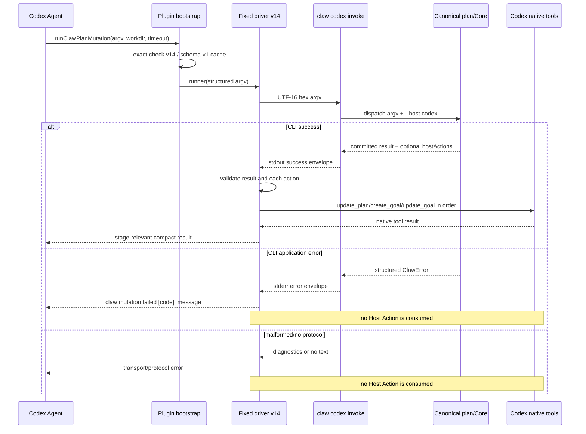

# 2026-08-24-0120 Codex桥接错误信封可见性修复

## 问题、范围与非目标

### 问题结论

`@veewo/claw@0.2.26` **没有漏发布 `codex invoke`**，`claw-kit@claw-kit 0.2.26.0` 的 v13 driver 也没有引用不存在的 CLI 接口。`claw help codex` 只列出 `driver` 是既有设计：`codex invoke` 是有意不进入公开 help 的内部 runtime interface。

真实缺陷位于 v13 driver 的失败路径。CLI 成功时在 stdout 返回 `{ ok, command, ... }`；CLI 应用错误时由统一错误处理器在 stderr 返回 `{ error: { code, message, details? } }`。v13 driver 只认可同时含有 `ok: boolean` 与 `command: string` 的 JSON，并且对不同 Codex command tool 的返回对象只择一读取 `output ?? stdout ?? text`。因此结构化 CLI 错误可能被完全漏读，或虽进入合并 `output` 却因不符合成功信封而退化为 `claw returned no valid JSON protocol result`。

本设计采用局部协议修复：driver 同时收集宿主返回中的文本通道、区分成功结果信封与错误信封，并保留 CLI 的错误 code/message。它不改变 canonical plan、Host Action、Goal 或 session binding 的 owner。

### 范围

- `packages/cli/src/codex-driver.ts` 中序列化 driver 的命令输出归一化、JSON 候选分类和失败传播。
- driver source 语义变更对应的 `CODEX_DRIVER_VERSION` / cache identity 升级。
- `packages/codex-adapter/skills/using-claw-kit/SKILL.md` 中 cold bootstrap 的期望 identity 同步。
- CLI driver 合同测试和真实嵌入 bootstrap 测试的相应更新。
- 后续 Truth 更新与真实 Windows + Codex Desktop 复测门禁。

### 非目标

- 不公开 `codex invoke`，不把它加入 `claw help codex`。
- 不替换 UTF-16 hex structured-argv transport，不引入 shell 拼接、direct-call 或 split-call fallback。
- 不改变 `plan sync`、session binding、canonical plan、Goal Mode 或 `hostActions` 的业务语义。
- 不把 CLI error 变成成功结果，也不在失败后执行任何 native host action。
- 不为一次局部失败传播缺陷创建通用 transport framework、durable replay、outbox 或新的 schema version。
- 不在本文实现、提交、发布、安装插件，亦不修改用户 `.claw`、session binding 或业务文件。
- 不声称仅靠错误可见性修复已消除原始 `plan sync` 的底层应用错误；同一失败任务必须用新 driver 复测后才能得到该结论。

## 现状证据与参考资料

### 已安装产物证据

1. 当前 PowerShell 命令解析到 `C:\nvm4w\nodejs\claw.ps1`，`claw --version` 返回 `0.2.26`；npm registry 的 `@veewo/claw@0.2.26` tarball 为 `https://registry.npmjs.org/@veewo/claw/-/claw-0.2.26.tgz`。
2. 已安装 CLI 的 `C:\nvm4w\nodejs\node_modules\@veewo\claw\dist\cli.js:620-653` 明确实现 `runCodex()` 的 `driver` 与 `invoke` 两个分支。`invoke` 解码 payload、校验 argv group、拒绝调用方传入 `--host`，再内部追加 `--host codex` 并重新分派。
3. 对已安装 CLI 执行 `claw codex invoke invalid` 得到 `PROJECT_CONFIG_INVALID: codex invoke requires one UTF-16 hex argv payload.`，exit code 为 1。该证据直接排除“0.2.26 不认识 invoke”的假设。
4. 已安装 `C:\nvm4w\nodejs\node_modules\@veewo\claw\dist\codex-driver.js:2-4,21-32,57-79` 返回 driver v13，执行固定 `claw codex invoke <hex>`；它只择一读取 `output/stdout/text`，只把带 `ok` 和 `command` 的对象认作 protocol result。
5. 已安装插件 `C:\Users\chany\.codex\plugins\cache\claw-kit\claw-kit\0.2.26.0\skills\using-claw-kit\SKILL.md:31-55` 固定期望 `claw-kit:codex-driver:v13:s1` / `driverVersion=13`，与已安装 CLI 一致。
6. 直接执行已安装 CLI 的有效 encoded argv `['plan','show']` 已进入 `invoke` 后的真实 plan 分派，并在当前子代理 session 上返回 `No plan is bound to the current session...` 的结构化 stderr 错误；这再次证明 transport 存在。把同样形状的 `{ error: ... }` 放进 Codex `exec_command` 的 `output` 返回给已安装 v13 source，稳定复现 `claw returned no valid JSON protocol result`。

### 仓库事实

- `packages/cli/src/cli.ts:302-311` 只在公开 help 注册 `codex driver`；`packages/cli/src/cli.ts:736-775` 的真实 parser 同时实现隐藏 `codex invoke`。
- `.claw/truth/features/cli-guided-workflow.md:72-83` 明确记载 `codex invoke` 是有意不公开的 runtime interface；help 缺项不是命令能力证据。
- `packages/cli/src/cli.ts:5066-5098` 规定成功 JSON 写 stdout，`ClawError` 与 unexpected error 结构化 JSON 写 stderr。
- `.claw/truth/adr/codex-plan-mutations-use-fixed-code-mode-consumer.md:23-45` 接受 fixed single-call consumer、structured argv、fail-closed、driver/cache identity bump 及 Host Action 单一消费源等不变量。
- `.claw/truth/features/codex-workflow-guidance-consumption.md:7-18,140-157` 记录 v13 当前合同：一次 code-mode 调用完成 CLI mutation 与 Host Action 消费，source SHA 与 version/cache identity 必须同步演进。
- `docs/platform-adapter-porting-guide.md:104-116,186-207` 指定 Core 是 plan 状态 owner，CLI 是 Host 投影/协议 owner，fixed driver 是 Codex 执行边界；Host 投影失败不得反向篡改 `.claw`。
- 当前未提交实现候选只触及 `packages/cli/src/codex-driver.ts`、CLI tests、Codex bootstrap tests 与 Codex skill identity；本文不覆盖或回退这些改动。

### 索引边界

按要求先执行了 `claw search "codex invoke driver v13 bridge protocol"`，命中上述 current Truth 与 accepted ADR。GitNexus 可用，但 `.gitnexus/meta.json` 的 `lastCommit=309dac46...`，当前 HEAD 为 `461908c2...`，且存在未提交修复；因此 GitNexus 只用于确认 `runCodex -> buildCodexDriverEnvelope` 等历史关系，当前代码与发布产物结论以 `rg`、精读源码和已安装运行时探针为准。没有重建索引，以免扩大本次只产出文档的写入范围。

## 领域模型、术语、不变量与唯一 owner

| 概念 | 定义 | 唯一 owner | 本设计中的不变量 |
| --- | --- | --- | --- |
| Canonical plan | `.claw` 中的计划状态与生命周期事实 | `@veewo/claw-core` / `packages/core/src/plan.ts` | driver 失败不回滚、不补写、不重放 plan mutation |
| Codex invocation transport | structured argv 到隐藏 CLI runtime command 的安全传输 | `packages/cli/src/cli.ts::runCodex` | 只允许 `plan/task/subplan`，CLI 独占 `--host codex` |
| CLI success result | `{ ok: boolean, command: string, ... }`；成功 mutation 可带 `hostActions` | CLI command/projection layer | 只有 `ok === true` 才能进入 Host Action 消费 |
| CLI error envelope | `{ error: { code: string, message: string, details?: unknown } }` | `packages/cli/src/cli.ts::handleError` | 错误必须保持可见；不得伪装为成功或泛化丢失 code/message |
| Command tool raw output | Codex `shell_command` / `exec_command` 返回的 string 或含 `output/stdout/stderr/text` 的对象 | Codex host tool | driver 只把它当 transport carrier，不让某一通道成为第二份协议事实 |
| Fixed driver | 自包含、版本化、可缓存的 CLI result parser 与 Host Action consumer | `packages/cli/src/codex-driver.ts::codexDriverRunner` | 先得到合法 success result，后消费白名单 action；失败时零 Host Action |
| Bootstrap compatibility | 插件从 CLI 获取、校验并缓存 driver envelope | `packages/codex-adapter/skills/using-claw-kit/SKILL.md::runClawPlanMutation` | plugin 只运行 exact driver/cache/schema identity，不做旧版 fallback |
| Host projection | `update_plan/create_goal/update_goal` 对 Codex 原生状态的单向投影 | `packages/cli/src/codex-host-actions.ts` 生成，fixed driver 消费 | 不是 canonical plan；失败不得反写 `.claw` |

核心不变量：

1. 失败信封是合法的 CLI 协议失败，不是 malformed transport；保留它不等于接受失败结果。
2. 任一命令通道中发现合法 success result 时，以 success result 为本次协议结果；只有没有 success result 时才传播合法 CLI error。
3. 非结构化文本、截断 JSON、未知对象或完全无文本仍 fail closed，并使用 transport/protocol 类泛化错误。
4. CLI error、result `ok !== true`、Host Action schema/tool/input 失败三类边界保持可区分，且都不制造伪成功。
5. 序列化 source 的任何行为变化必须升级 driver version/cache identity，并同步 plugin bootstrap；旧线程缓存不得无声复用 v13。

## 技术决策及每项决策的原因

### 决策 1：保留隐藏 `codex invoke`

不改 help 与 parser 架构。现有隐藏入口已经在 0.2.26 发布产物中存在并通过运行时探针验证；公开它不能修复失败传播，反而扩大用户可调用的内部安全 transport surface。

### 决策 2：在 fixed driver 内归一化所有已知文本通道

对 string raw 直接使用；对对象按 `output`、`stdout`、`stderr`、`text` 收集非空 string，去重后连接供同一 JSON candidate scanner 使用。原因：Codex Desktop 版本/工具不同会把 stderr 分离或合并进 `output`，driver 不应让宿主包装差异改变 CLI 协议语义。

不把 exit code 设为协议 owner：command tool 的退出元数据形状不是跨工具稳定合同，而 CLI 的 JSON success/error envelope 才是可验证语义。exit code 可用于未来诊断，但不能代替 envelope 分类。

### 决策 3：同一扫描器区分 success result 与 CLI error envelope

- success candidate：对象且 `ok` 为 boolean、`command` 为 string；保留现有 host-action 路径。
- error candidate：对象的 `error.code` 与 `error.message` 都是 string；只保存为待传播失败，绝不进入 Host Action 消费。
- 扫描完没有 success、但有 error：抛出保留 code/message 的 `claw mutation failed [CODE]: message`。
- 两类都没有：保留 `claw returned no valid JSON protocol result`。

原因：CLI 的统一 `handleError` 已经拥有错误格式；driver 只需识别，不应要求 CLI 为 Codex 特设第二套错误 schema，也不应把 error 包装成 `{ ok:false, command }` 来骗过成功 parser。

### 决策 4：driver/cache identity 从 v13 升为 v14，Host Action schema 保持 v1

变化发生在可序列化 runner 的协议解释语义，必须使同线程缓存失效。它没有改变 `hostActions` envelope，因此 `CODEX_HOST_ACTION_SCHEMA_VERSION` 继续为 1。bootstrap 必须 exact-match v14；不提供 v13/v14 双读或 fallback，以保持 fail-closed 和一次可信 bootstrap。

### 决策 5：不扩展为通用 parser 模块或 bootstrap 重构

driver source 通过 `codexDriverRunner.toString()` 在 isolate 内执行，外部 helper 不会随 source 自动分发。把本次逻辑保持在自包含 runner 中，是最小且可验证的边界。cold bootstrap 自己获取 `claw codex driver` 时的 stderr 诊断属于相邻但未复现的入口；本次只同步 identity，不借机建立重复 parser。若以后独立复现 bootstrap stderr 丢失，再以相同 failure-visibility 不变量评估局部修复。

## 协作合同：入口、状态变化、事件或投影、失败与重试语义

### 入口合同

- Agent 仍只传 `argv: string[]`、`workdir: string`、可选 `timeout_ms`。
- bootstrap 只加载 exact `cacheKey=claw-kit:codex-driver:v14:s1`、`driverVersion=14`、`hostActionSchemaVersion=1` 的 source。
- driver 只执行 `claw codex invoke <hex>`，不接受 Agent 传入 executable、shell command 或 `--host`。

### 状态变化与投影

- CLI mutation 是否修改 canonical plan，继续由 Core/CLI 的命令语义决定；driver 不参与。
- success envelope 可携带 `hostActions`，driver 校验后按顺序投影到 Codex native tools。
- error envelope 不产生 state event 或 host projection；若 CLI 在报错前已有部分 canonical 写入，仍遵守既有“先检查 canonical state、不得盲目重放”的恢复合同，本修复不引入回滚承诺。

### 失败语义

| 失败阶段 | 可见错误 | 状态不变性 |
| --- | --- | --- |
| 输入校验 | structured argv/workdir TypeError | CLI 未启动，canonical 与 Host 均不变 |
| CLI 应用错误 | `claw mutation failed [code]: message` | driver 不消费 Host Action；canonical 是否已写由具体 CLI 命令合同决定 |
| 无文本或无合法 JSON | no-text / no-valid-protocol | driver 不消费 Host Action；调用方不得假设 CLI 未执行 |
| `ok !== true` result | CLI mutation failed | driver 不消费 Host Action |
| Host Action 校验/执行失败 | 既有 unsupported/invalid/host tool error | canonical mutation 可能已提交；不得重放 canonical transition |

### 重试语义

- 对明确的 CLI application error，先按 `code/message` 修复前置条件；不得用同参数盲目重试掩盖错误。
- 对 malformed/no protocol，结果可能 unknown；先只读检查 plan/session 状态，再决定是否重试。
- 对 Host Action 失败，canonical plan 已可能提交；沿用既有 recovery-only `plan sync`，不重放原 mutation。
- driver 自身不自动 retry，不吞错，不 fallback 到 Agent 手写 Host Action。

## 备选方案、取舍与重新评估条件

### 方案 A：把 `codex invoke` 加入 help

拒绝。它不能修复 stderr/error-envelope 丢失，而且违背现行“内部 runtime interface”边界。只有产品决定把 structured invoke 变成受支持的公共 CLI API 时重新评估。

### 方案 B：让 CLI error 也输出 `{ ok:false, command, error }`

暂不采用。它会改变统一 CLI 错误格式与更多消费者，只为适配 driver 的成功 parser；同时仍需解决 stderr 被宿主分离的问题。只有未来把 CLI 全部 command 统一为显式双态 envelope 并能迁移所有消费者时重新评估。

### 方案 C：只读取 stderr，或按退出码分支

拒绝。Codex command tools 可能返回 raw string、合并 `output` 或独立 stdout/stderr；单通道修复会在另一宿主形状上继续丢错。退出码可以提示失败，但不能提供稳定的 code/message，也不能安全识别混合诊断中的 success envelope。

### 方案 D：用 generic parser/shared transport abstraction

暂不采用。当前只有一个自包含序列化 runner 需要这个局部分类，引入模块还会与 `toString()` 分发机制冲突。出现第二个真实消费者且需要同一完整解析语义时再评估 nested shared source 或正式协议库。

### 方案 E：保留 v13 identity，原地改变 source

拒绝。同线程缓存会继续运行旧 source，导致相同版本身份对应两种行为，并破坏 SHA/version 回归合同。

## 实施切片、迁移或兼容边界、验证证据

### 切片 1：固定 driver 失败传播

受影响 owner：`packages/cli/src/codex-driver.ts::codexDriverRunner`。

- 收集 string raw 或对象的 `output/stdout/stderr/text` 非空文本并去重。
- 在既有完整 JSON candidate scanner 中同时识别 success result 与 CLI error envelope。
- success 路径与 Host Action 消费逻辑保持不变；只有无 success 时传播 error。
- bump `CODEX_DRIVER_VERSION` 到 14，更新 source SHA snapshot。

验收：给 runner 返回 `{ stdout: "", stderr: JSON.stringify({ error: { code, message } }) }` 时，抛出的错误保留 code/message，且 native Host tools 调用次数为 0；原有成功、混合诊断、恶意 argv、Host Action schema 与 Goal 幂等测试继续通过。

### 切片 2：plugin bootstrap identity 同步

受影响 owner：`packages/codex-adapter/skills/using-claw-kit/SKILL.md::runClawPlanMutation` 与 `packages/codex-adapter/hooks/code-mode-host-action-consumer.test.mjs`。

- cold bootstrap exact-match v14/s1。
- 嵌入 skill 的 VM 测试同时覆盖 `shell_command` 与 `exec_command` 入口仍只 bootstrap 一次并复用缓存。
- 不兼容 v13 source 必须 fail closed，不自动执行。

### 切片 3：Truth 与发布前运行时验证

实现合入后更新：

- `.claw/truth/features/codex-workflow-guidance-consumption.md` 中 current v13 identity 与 parser 行为为 v14，并补充 CLI error visibility。
- 若稳定决策需要沉淀，在现有 `.claw/truth/adr/codex-plan-mutations-use-fixed-code-mode-consumer.md` 演化历史追加 failure-envelope 分类；不新建第二份 owner ADR。

比例化验证顺序：

1. focused CLI test：`packages/cli/test/cli-host-actions.test.ts` 的 driver envelope、stderr structured error、structured invoke 与既有 protocol-validation cases。
2. Codex adapter check：实际嵌入 bootstrap 的 VM tests，确认 v14 identity 与缓存行为。
3. build/pack smoke：确认发布候选 `dist/cli.js` 仍含隐藏 `invoke`，`dist/codex-driver.js` 为 v14 且 source SHA 与测试一致。
4. Windows + Codex Desktop unpublished-build smoke：在独立测试任务中 cold bootstrap，运行一个成功 mutation，并构造/触发一个可预期 CLI application error，确认显示原始 code/message 且未调用 Host Action。
5. 在原始失败任务或等价 session binding 上重跑 `plan sync`。若得到成功结果，才可关闭原始 bridge 故障；若得到具体 CLI error，则以该错误为新的独立诊断输入，不能宣称本次可见性修复解决了底层 plan/session 问题。

### 迁移与兼容边界

- driver v14 与插件 bootstrap v14 是一个原子兼容单元；后续发布/安装必须同时可获得匹配的 CLI 与官方 Codex plugin artifact。
- 不采用 v13/v14 双读、兼容 fallback 或旧 cache reuse。新任务/新线程通过 cold bootstrap 获取 v14；旧线程若仍缓存 v13，不作为新版本验收环境。
- Host Action schema 仍为 v1，canonical plan 与 `.claw` 数据无需迁移。
- 本设计不指定发布版本号或执行发布；由后续 artifact-specific release 流程根据仓库规则决定。

## 开放决策

无高影响未决架构选择。唯一未闭合项是运行时事实：原始 `plan sync` 的底层 CLI error 尚未被 v13 暴露。推荐先完成 v14 failure visibility 并在同一故障样本复测，因为只有精确 error code/message 能决定是否还存在 session binding 或 plan lifecycle 的第二个缺陷。

## 状态

`ready`
